## CSS 简介
CSS 是层叠样式表 ( Cascading Style Sheets ) 的简称。

CSS 是也是一种标记语言，主要用于设置 HTML 页面中的文本内容（字体、大小、对齐方式等）、图片的外形（宽高、边框样式、边距等）以及版面的布局和外观显示样式。
## CSS 语法规范
```
<head>
 <style>
 h4 {
 color: blue;
 font-size: 100px;
 }
 </style>
</head>
```
##  CSS 的三大特性
CSS 有三个非常重要的三个特性：层叠性、继承性、优先级。
### 层叠性
相同选择器给设置相同的样式，此时一个样式就会覆盖（层叠）另一个冲突的样式。层叠性主要解决样式冲突的问题

层叠性原则：
- 样式冲突，遵循的原则是就近原则，哪个样式离结构近，就执行哪个样式
-  样式不冲突，不会层叠
### 继承性
CSS中的继承: 子标签会继承父标签的某些样式，如文本颜色和字号。

恰当地使用继承可以简化代码，降低 CSS 样式的复杂性

子元素可以继承父元素的样式（text-，font-，line-这些元素开头的可以继承，以及color属性）

行高的继承性
```
body {
 font:12px/1.5 Microsoft YaHei；
}
```
行高可以跟单位也可以不跟单位

如果子元素没有设置行高，则会继承父元素的行高为 1.5

此时子元素的行高是：当前子元素的文字大小 * 1.5

body 行高 1.5 这样写法最大的优势就是里面子元素可以根据自己文字大小自动调整行高
### 优先级
当同一个元素指定多个选择器，就会有优先级的产生。

选择器相同，则执行层叠性，选择器不同，则根据选择器权重执行
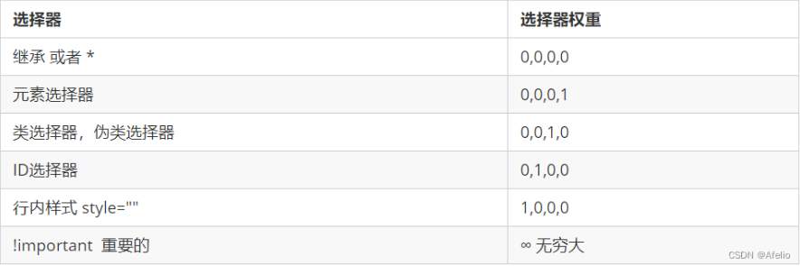
-  权重是有4组数字组成,但是不会有进位。
-  可以理解为类选择器永远大于元素选择器, id选择器永远大于类选择器,以此类推…
-  等级判断从左向右，如果某一位数值相同，则判断下一位数值。
-  可以简单记忆法: 通配符和继承权重为0, 标签选择器为1,类(伪类)选择器为 10, id选择器 100, 行内样式表为
-  1000, !important 无穷大.
-  继承的权重是0， 如果该元素没有直接选中，不管父元素权重多高，子元素得到的权重都是 0。
权重叠加：如果是复合选择器，则会有权重叠加，需要计算权重。
```
  div ul li ------> 0,0,0,3
  .nav ul li ------> 0,0,1,2
  a:hover -----—> 0,0,1,1
  .nav a ------> 0,0,1,1
```
## CSS 选择器
选择器分为基础选择器和复合选择器两个大类
### 基础选择器
基础选择器是由单个选择器组成的，包括：标签选择器、类选择器、id 选择器和通配符选择器

#### 标签选择器
标签选择器（元素选择器）是指用 HTML 标签名称作为选择器，按标签名称分类，为页面中某一类标签指定

标签选择器可以把某一类标签全部选择出来，比如所有的 `<div>` 标签和所有的 `<span>` 标签。

优点：能快速为页面中同类型的标签统一设置样式。

缺点：不能设计差异化样式，只能选择全部的当前标签。
#### 类选择器
想要差异化选择不同的标签，单独选一个或者某几个标签，可以使用类选择器，类选择器在 HTML 中以 class 属性表示，在 CSS 中，类选择器以一个点“.”号显示。

在标签class 属性中可以写多个类名，多个类名中间必须用空格分开。
#### id选择器
id 选择器可以为标有特定 id 的 HTML 元素指定特定的样式。

HTML 元素以 id 属性来设置 id 选择器，CSS 中 id 选择器以“#" 来定义。

注意：id 属性只能在每个 HTML 文档中出现一次。
#### 通配符选择器
在 CSS 中，通配符选择器使用“*”定义，它表示选取页面中所有元素（标签）。
### 复合选择器
常用的复合选择器包括：后代选择器、子选择器、并集选择器、伪类选择器等等
#### 后代选择器
后代选择器又称为包含选择器，可以选择父元素里面子元素。其写法就是把外层标签写在前面，内层标签写在后面，中间用空格分隔。当标签发生嵌套时，内层标签就成为外层标签的后代。
```
元素1 元素2 { 样式声明 }
```
-  元素1 和 元素2 中间用空格隔开
-  元素1 是父级，元素2 是子级，最终选择的是元素2
-  元素2 可以是儿子，也可以是孙子等，只要是元素1 的后代即可
-  元素1 和 元素2 可以是任意基础选择器
#### 子选择器
子元素选择器（子选择器）只能选择作为某元素的最近一级子元素。简单理解就是选亲儿子元素。
```
元素1 > 元素2 { 样式声明 }
```
-  元素1 和 元素2 中间用 大于号 隔开
-  元素1 是父级，元素2 是子级，最终选择的是元素2
-  元素2 必须是亲儿子，其孙子、重孙之类都不归他管. 也可以叫他亲儿子选择器
#### 并集选择器
并集选择器是各选择器通过英文逗号（,）连接而成，任何形式的选择器都可以作为并集选择器的一部分。
```
元素1,元素2 { 样式声明 }
```
#### 伪类选择器
伪类选择器用于向某些选择器添加特殊的效果，比如给链接添加特殊效果，或选择第1个，第n个元素。

伪类选择器书写最大的特点是用冒号（:）表示，比如 `:hover `、 `:first-child `。

##### 链接伪类选择器
为了确保生效，请按照 LVHA 的循顺序声明 `:link－:visited－:hover－:active`。

因为 a 链接在浏览器中具有默认样式，所以我们实际工作中都需要给链接单独指定样式。
```
 /* a 是标签选择器 所有的链接 */ 
 a { 
 color: gray;
 }
 /* :hover 是链接伪类选择器 鼠标经过 */
 a:hover { 
 color: red; /* 鼠标经过的时候，由原来的 灰色 变成了红色 */
 }
```
#####  :focus 伪类选择器
:focus 伪类选择器用于选取获得焦点的表单元素。

焦点就是光标，一般情况 `<input> `类表单元素才能获取，因此这个选择器也主要针对于表单元素来说。
```
input:focus { 
 background-color:yellow;
}
```
## CSS 字体属性
CSS Fonts (字体)属性用于定义字体系列、大小、粗细、和文字样式（如斜体）
### 字体系列
CSS 使用 `font-family `属性定义文本的字体系列。
```
p { font-family:"微软雅黑";} 
div {font-family: Arial,"Microsoft Yahei", "微软雅黑";}
```
最常见的几个字体：`body {font-family: ‘Microsoft YaHei’,tahoma,arial,‘Hiragino Sans GB’; }`
###  字体大小
CSS 使用 `font-size `属性定义字体大小

不同浏览器可能默认显示的字号大小不一致，谷歌浏览器默认的文字大小为16px。
### 字体粗细
CSS 使用 `font-weight` 属性设置文本字体的粗细。`font-weight: normal(默认不加粗)=400/bold(加粗)=700/100-900`
### 文字样式
CSS 使用`font-style` 属性设置文本的风格。
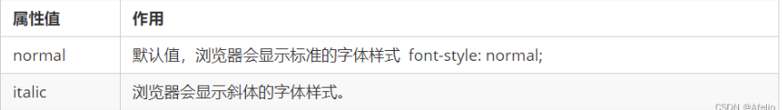
### 字体复合属性
```
body { 
 font: font-style font-weight font-size/line-height font-family;
}

```
使用 `font` 属性时，必须按上面语法格式中的顺序书写，不能更换顺序，并且各个属性间以空格隔开
不需要设置的属性可以省略（取默认值），但必须保留 `font-size` 和 `font-family` 属性，否则 `font` 属性将不起作用

## 文本属性
CSS Text（文本）属性可定义文本的外观，比如文本的颜色、对齐文本、装饰文本、文本缩进、行间距等

### 文本颜色
```
div { 
 color: red;
}
```
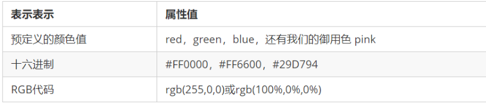
### 对齐文本
`text-align` 属性用于设置元素内文本内容的水平对齐方式。
```
div { 
 text-align: center;
}
```
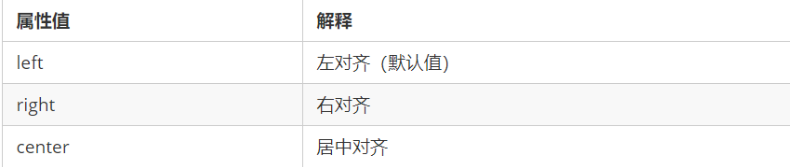
### 装饰文本
`text-decoration` 属性规定添加到文本的修饰。可以给文本添加下划线、删除线、上划线等。
```
div { 
 text-decoration：underline；
}
```
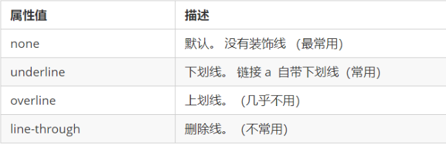
### 文本缩进
`text-indent` 属性用来指定文本的第一行的缩进，通常是将段落的首行缩进

### 行间距
`line-height` 属性用于设置行间的距离（行高）。可以控制文字行与行之间的距离。
```
p { 
 line-height: 26px;
}
```
## CSS 引入方式
按照 CSS 样式书写的位置（或者引入的方式），CSS 样式表可以分为三大类：

-  行内样式表（行内式）
-  内部样式表（嵌入式）
-  外部样式表（链接式）

```
引入外部样式表：
<link rel="stylesheet" href="css文件路径">
```
## CSS 的元素显示模式
可以更好的布局网页，元素显示模式就是元素（标签）以什么方式进行显示，比如`<div>`自己占一行，比如一行可以放多个`<span>`。

HTML 元素一般分为块元素和行内元素两种类型。
### 块元素
常见的块元素有`<h1>~<h6>、<p>、<div>、<ul>、<ol>、<li>`等，其中 `<div>` 标签是最典型的块元素。
块级元素的特点：
① 独占一行。

② 高度，宽度、外边距以及内边距都可以控制。

③ 宽度默认是容器（父级宽度）的100%。

④ 是一个容器及盒子，里面可以放行内或者块级元素。

注意：

文字类的元素内不能使用块级元素

`<p>` 标签主要用于存放文字，因此 `<p>` 里面不能放块级元素，特别是不能放`<div>`

同理， `<h1>~<h6>`等都是文字类块级标签，里面也不能放其他块级元素
### 行内元素
常见的行内元素有 `<a>、<strong>、<b>、<em>、<i>、<del>、<s>、<ins>、<u>、<span>`等，其中
`<span>` 标签是最典型的行内元素。有的地方也将行内元素称为内联元素。

行内元素的特点：

① 相邻行内元素在一行上，一行可以显示多个。

② 高、宽直接设置是无效的。

③ 默认宽度就是它本身内容的宽度。

④ 行内元素只能容纳文本或其他行内元素。

注意：

链接里面不能再放链接
特殊情况链接 `<a>` 里面可以放块级元素，但是给 `<a> `转换一下块级模式最安全
### 行内块元素
在行内元素中有几个特殊的标签 —— ``、`<input />`、`<td>`，它们同时具有块元素和行内元素的特点。

有些资料称它们为行内块元素。

行内块元素的特点：

① 和相邻行内元素（行内块）在一行上，但是他们之间会有空白缝隙。一行可以显示多个（行内元素特点）。

② 默认宽度就是它本身内容的宽度（行内元素特点）。

③ 高度，行高、外边距以及内边距都可以控制（块级元素特点）。

### 元素显示模式转换
特殊情况下，需要元素模式的转换，简单理解: 一个模式的元素需要另外一种模式的特性
比如想要增加链接 `<a>` 的触发范围。

转换为块元素：display:block;

转换为行内元素：display:inline;

转换为行内块：display: inline-block;
## CSS 的背景
背景属性可以设置背景颜色、背景图片、背景平铺、背景图片位置、背景图像固定等。
### 背景颜色
`background-color` 属性定义了元素的背景颜色
```
background-color:颜色值;
```
一般情况下元素背景颜色默认值是 transparent（透明），也可以手动指定背景颜色为透明色
```
background-color:transparent;
```

### 背景图片
`background-image` 属性描述了元素的背景图像。实际开发常见于 logo 或者一些装饰性的小图片或者是超大的背景图片, 优点是非常便于控制位置. (精灵图也是一种运用场景)
```
background-image : none | url (url)
```
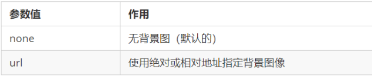
注意：背景图片后面的地址，千万不要忘记加url， 同时里面的路径不要加引号
### 背景平铺
如果需要在 HTML 页面上对背景图像进行平铺，可以使用 background-repeat 属性
```
background-repeat: repeat | no-repeat | repeat-x | repeat-y
```
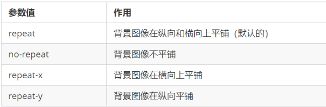
### 背景图片位置
利用 `background-position` 属性可以改变图片在背景中的位置。
```
background-position: x y;
```
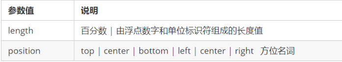
参数是方位名词

如果指定的两个值都是方位名词，则两个值前后顺序无关，比如 left top 和 top left 效果一致

如果只指定了一个方位名词，另一个值省略，则第二个值默认居中对齐

参数是精确单位

如果参数值是精确坐标，那么第一个肯定是 x 坐标，第二个一定是 y 坐标

如果只指定一个数值，那该数值一定是 x 坐标，另一个默认垂直居中

参数是混合单位

如果指定的两个值是精确单位和方位名词混合使用，则第一个值是 x 坐标，第二个值是 y 坐标

### 背景图像固定
background-attachment 属性设置背景图像是否固定或者随着页面的其余部分滚动。

background-attachment 后期可以制作视差滚动的效果。
```
background-attachment : scroll | fixed
```
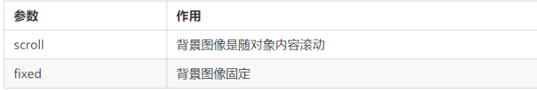
### 背景复合写法
为了简化背景属性的代码，我们可以将这些属性合并简写在同一个属性 background 中。从而节约代码量.

当使用简写属性时，没有特定的书写顺序,一般习惯约定顺序为：

background: 背景颜色 背景图片地址 背景平铺 背景图像滚动 背景图片位置;
```
background: transparent url(image.jpg) repeat-y fixed top ;
```
### 背景色半透明
CSS3 提供了背景颜色半透明的效果。
```
background: rgba(0, 0, 0, 0.3);
```
-  最后一个参数是 alpha 透明度，取值范围在 0~1之间
-  我们习惯把 0.3 的 0 省略掉，写为 `background: rgba(0, 0, 0, .3)`;
-  注意：背景半透明是指盒子背景半透明，盒子里面的内容不受影响
-  CSS3 新增属性，是 IE9+ 版本浏览器才支持的
## 盒子模型
网页布局过程：

先准备好相关的网页元素，网页元素基本都是盒子 Box 。

利用 CSS 设置好盒子样式，然后摆放到相应位置。

往盒子里面装内容。

网页布局的核心本质： 就是利用 CSS 摆盒子。

所谓 盒子模型：就是把 HTML 页面中的布局元素看作是一个矩形的盒子，也就是一个盛装内容的容器。

CSS 盒子模型本质上是一个盒子，封装周围的 HTML 元素，它包括：边框(border)、外边距(margin)、内边距(padding) 和 实际内容(content)
### 边框（border）
border可以设置元素的边框。边框有三部分组成:边框宽度(粗细)、边框样式、边框颜色
```
border : border-width || border-style || border-color
```
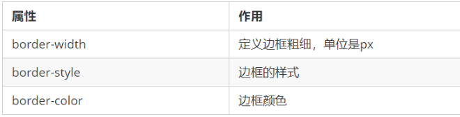
边框样式 border-style 可以设置如下值：

-  none：没有边框即忽略所有边框的宽度（默认值）
-  solid：边框为单实线(最为常用的)
-  dashed：边框为虚线
-  dotted：边框为点线
边框简写：
```
border: 1px solid red; 没有顺序
```
边框分开写
```
border-top: 1px solid red; /* 只设定上边框， 其余同理 */
```
#### 表格的细线边框
border-collapse 属性控制浏览器绘制表格边框的方式。它控制相邻单元格的边框
```
border-collapse: collapse;
```
-  collapse: 单词是合并的意思
-  border-collapse: collapse; 表示相邻边框合并在一起

边框会额外增加盒子的实际大小。因此有两种方案解决:

-  测量盒子大小的时候,不量边框.  
-  如果测量的时候包含了边框,则需要 width/height 减去边框宽度
#### 圆角边框
在 CSS3 中，新增了圆角边框样式，border-radius 属性用于设置元素的外边框圆角。
```
border-radius:length;
```
-  参数值可以为数值或百分比的形式。如果是正方形，想要设置为一个圆，把数值修改为高度或者宽度的一半即可，或者直接写为 50%
-  该属性是一个简写属性，可以跟四个值，分别代表左上角、右上角、右下角、左下角分开写：border-top-left-radius、border-top-right-radius、border-bottom-right-radius 和 border-bottom-left-radius
-  兼容性 ie9+ 浏览器支持, 但是不会影响页面布局,可以放心使用.
### 内边距（padding）
padding 属性用于设置内边距，即边框与内容之间的距离。
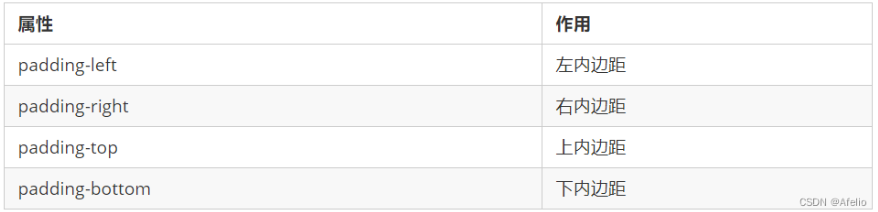

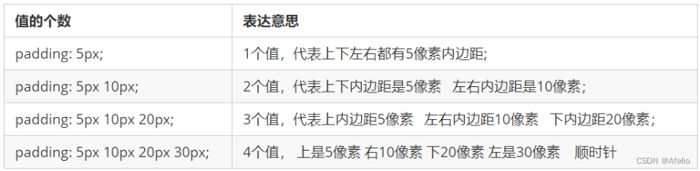
给盒子指定 padding 值之后，发生了 2 件事情：

内容和边框有了距离，添加了内边距。

padding影响了盒子实际大小。

也就是说，如果盒子已经有了宽度和高度，此时再指定内边框，会撑大盒子。

解决方案：

如果保证盒子跟效果图大小保持一致，则让 width/height 减去多出来的内边距大小即可、

### 外边距（margin）
margin 属性用于设置外边距，即控制盒子和盒子之间的距离。
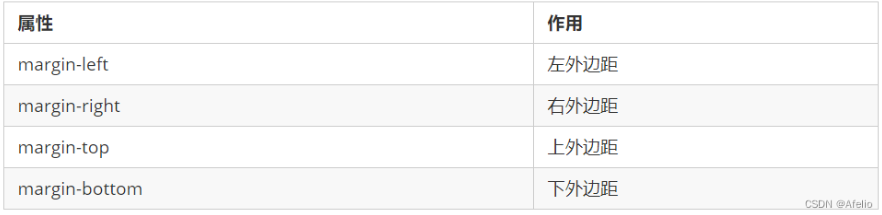
margin 简写方式代表的意义跟 padding 完全一致。

外边距可以让块级盒子水平居中，但是必须满足两个条件：

① 盒子必须指定了宽度（width）。

② 盒子左右的外边距都设置为 auto 。
```
.header{ width:960px; margin:0 auto;}
```
注意：以上方法是让块级元素水平居中，行内元素或者行内块元素水平居中给其父元素添加 text-align:center 即可。

使用 margin 定义块元素的垂直外边距时，可能会出现外边距的合并。

主要有两种情况:
-  相邻块元素垂直外边距的合并
-  嵌套块元素垂直外边距的塌陷
#### 相邻块元素垂直外边距的合并
当上下相邻的两个块元素（兄弟关系）相遇时，如果上面的元素有下外边距 margin-bottom，下面的元素有上外边距 margin-top ，则他们之间的垂直间距不margin-bottom 与 margin-top 之和。取两个值中的较大者这种现象被称为相邻块元素垂直外边距的合并。

解决方案：

尽量只给一个盒子添加 margin 值。
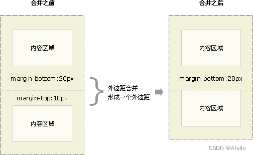

#### 嵌套块元素垂直外边距的塌陷
两个嵌套关系的（父子关系）块元素，当父元素有上外边距或者没有上外边距（margin-top），子元素也有上外边距的时候。两个上外边距会合成一个上外边距，以值相对较大的上外边距值为准。如下图：

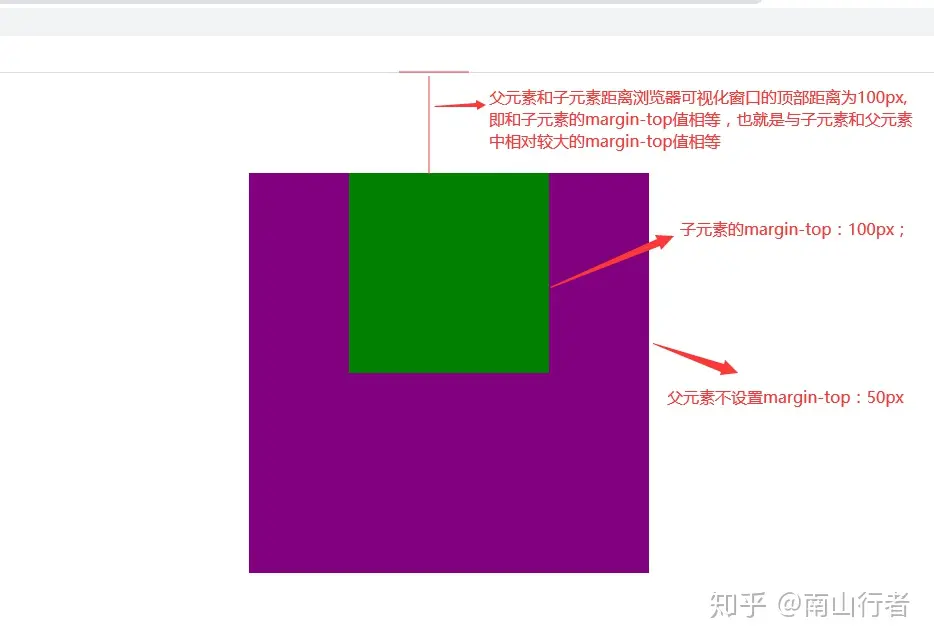

这种现象就是外边距的塌陷问题。这个时候你就会发现你给父元素设置的margin-top：50px是没有效果的。或者在你需要调整子元素的上边距相对于父元素产生一定的距离的时候也是没有效果的。这种外边距塌陷的问题可以说是css中的一个bug。因为这种现象我们通常是需要避免的，也是我们不需要的，因为在页面布局中，使用margin-top通常是希望子元素的顶部相对于父元素的顶部产生一定的距离。比如在使用margin调整子元素相对于父元素居中的时候。那么又应该如何去解决这个问题呢？

1、给父元素设置外边框（border）或者内边距（padding）(不建议)
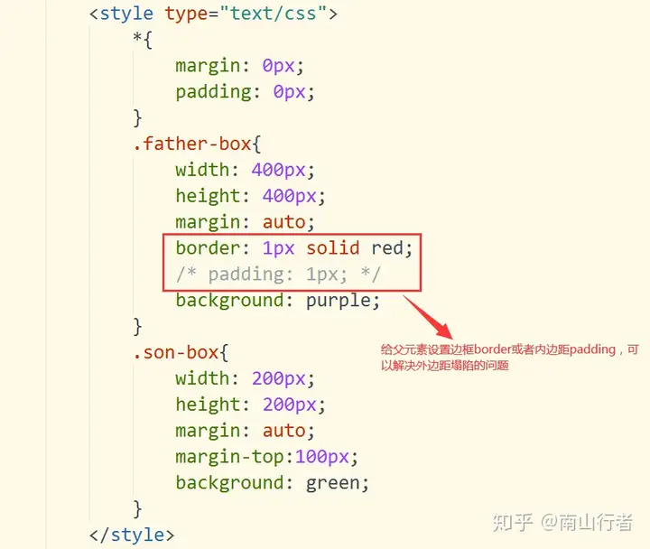
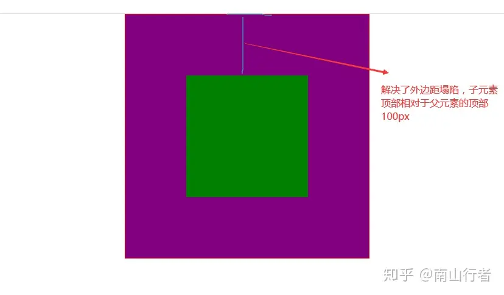
这种方案虽然可以解决外边距塌陷的问题，但是border和padding毕竟会撑大盒子，处理不好也会出问题，所以推荐使用这种方式。

2、触发BFC（推荐）
BFC：Block Formatting Context，块级格式化上下文，BFC决定了元素对其内容定位，以及当前元素与其他元素之间的关系和相互作用。其目的就是形成一个独立的空间，让空间中的子元素不会影响到这个独立空间之外的布局。这样我们在写页面的时候就可以根据自己的需求，选择一些比较合适的解决方案，主要解决方案如下：

1. 子元素或者父元素的float不为none
2. 子元素或者父元素的position不为relative或static
3. 父元素的overflow为auto或scroll或hidden
4. 父元素的display的值为table-cell或inline-block
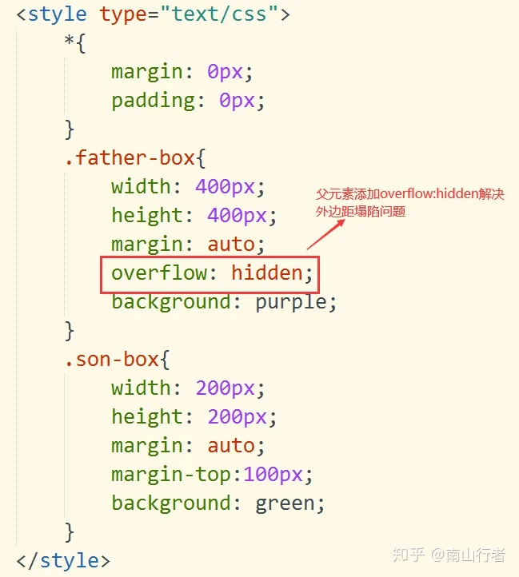
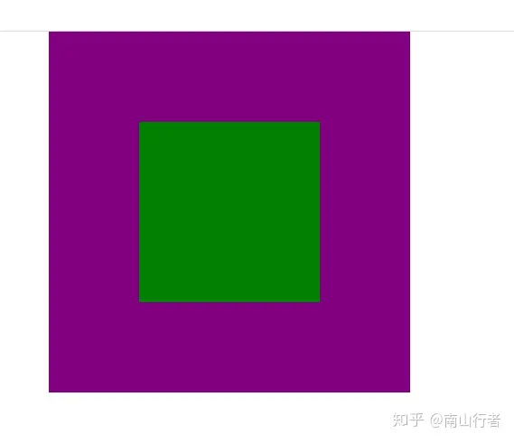
### 清除内外边距
网页元素很多都带有默认的内外边距，而且不同浏览器默认的也不一致。因此我们在布局前，首先要清除下网页元素的内外边距。
```
* {
 padding:0; /* 清除内边距 */
 margin:0; /* 清除外边距 */
 }
```
注意：行内元素为了照顾兼容性，尽量只设置左右内外边距，不要设置上下内外边距。但是转换为块级和行内块元素就可以了

## 阴影
### 盒子阴影
CSS3 中新增了盒子阴影，可以使用 box-shadow 属性为盒子添加阴影。
```
box-shadow: h-shadow v-shadow blur spread color inset;
```
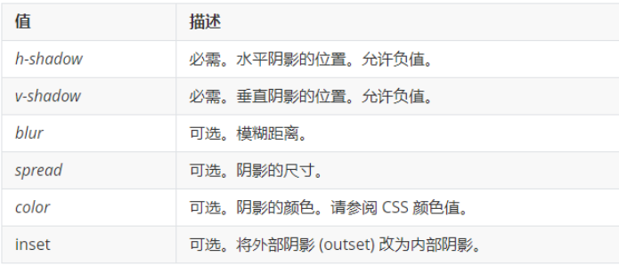
注意：

默认的是外阴影(outset), 但是不可以写这个单词,否则造成阴影无效

盒子阴影不占用空间，不会影响其他盒子排列。
### 文字阴影
在 CSS3 中，可以使用 text-shadow 属性将阴影应用于文本
```
text-shadow: h-shadow v-shadow blur color;
```
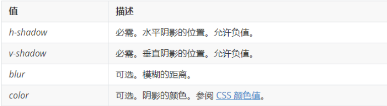
## 布局方式
CSS 提供了三种传统布局方式(简单说,就是盒子如何进行排列顺序)：普通流（标准流）、浮动、定位。
### 标准流（普通流/文档流）
所谓的标准流: 就是标签按照规定好默认方式排列，标准流是最基本的布局方式。

块级元素会独占一行，从上向下顺序排列。

常用元素：div、hr、p、h1~h6、ul、ol、dl、form、table

行内元素会按照顺序，从左到右顺序排列，碰到父元素边缘则自动换行。

常用元素：span、a、i、em 等
### 浮动
float 属性用于创建浮动框，将其移动到一边，直到左边缘或右边缘触及包含块或另一个浮动框的边缘。
```
选择器 { float: 属性值; }
```
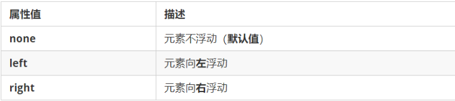
加了浮动之后的元素,会具有很多特性：

-  浮动元素会脱离标准流(脱标)
-  浮动的元素会一行内显示并且元素顶部对齐
-  浮动的元素会具有行内块元素的特性.
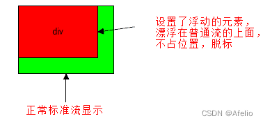
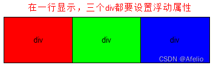

注意： 浮动的元素是互相贴靠在一起的（不会有缝隙），如果父级宽度装不下这些浮动的盒子， 多出的盒子会另起一行对齐。

浮动元素会具有行内块元素特性:
-  任何元素都可以浮动。不管原先是什么模式的元素，添加浮动之后具有行内块元素相似的特性。
-  如果块级盒子没有设置宽度，默认宽度和父级一样宽，但是添加浮动后，它的大小根据内容来决定。
-  浮动元素经常和标准流父级搭配使用，先用标准流的父元素排列上下位置, 之后内部子元素采取浮动排列左右位置。
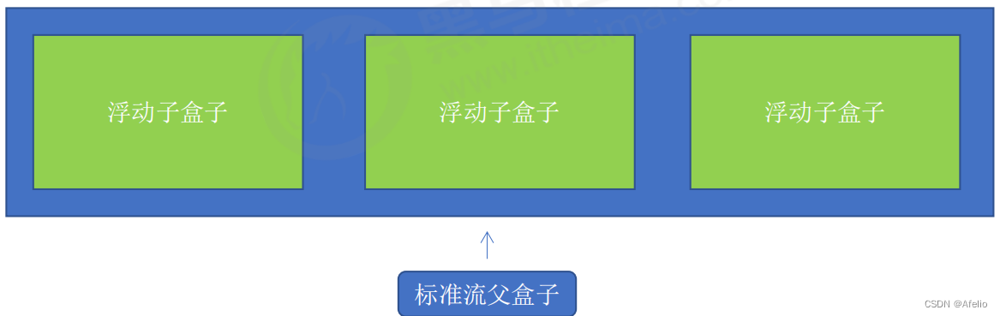
浮动布局注意点

-  浮动和标准流的父盒子搭配。
-  先用标准流的父元素排列上下位置, 之后内部子元素采取浮动排列左右位置
-  一个元素浮动了，理论上其余的兄弟元素也要浮动。
-  一个盒子里面有多个子盒子，如果其中一个盒子浮动了，那么其他兄弟也应该浮动，以防止引起问题。
-  浮动的盒子只会影响浮动盒子后面的标准流,不会影响前面的标准流.
