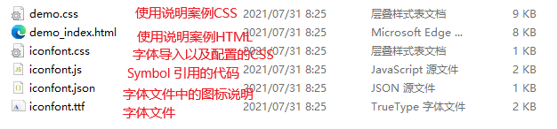

## CSS 简介
CSS 是层叠样式表 ( Cascading Style Sheets ) 的简称。

CSS 是也是一种标记语言，主要用于设置 HTML 页面中的文本内容（字体、大小、对齐方式等）、图片的外形（宽高、边框样式、边距等）以及版面的布局和外观显示样式。
## CSS 语法规范
```
<head>
 <style>
 h4 {
 color: blue;
 font-size: 100px;
 }
 </style>
</head>
```
##  CSS 的三大特性
CSS 有三个非常重要的三个特性：层叠性、继承性、优先级。
### 层叠性
相同选择器给设置相同的样式，此时一个样式就会覆盖（层叠）另一个冲突的样式。层叠性主要解决样式冲突的问题

层叠性原则：
- 样式冲突，遵循的原则是就近原则，哪个样式离结构近，就执行哪个样式
-  样式不冲突，不会层叠
### 继承性
CSS中的继承: 子标签会继承父标签的某些样式，如文本颜色和字号。

恰当地使用继承可以简化代码，降低 CSS 样式的复杂性

子元素可以继承父元素的样式（text-，font-，line-这些元素开头的可以继承，以及color属性）

行高的继承性
```
body {
 font:12px/1.5 Microsoft YaHei；
}
```
行高可以跟单位也可以不跟单位

如果子元素没有设置行高，则会继承父元素的行高为 1.5

此时子元素的行高是：当前子元素的文字大小 * 1.5

body 行高 1.5 这样写法最大的优势就是里面子元素可以根据自己文字大小自动调整行高
### 优先级
当同一个元素指定多个选择器，就会有优先级的产生。

选择器相同，则执行层叠性，选择器不同，则根据选择器权重执行

-  权重是有4组数字组成,但是不会有进位。
-  可以理解为类选择器永远大于元素选择器, id选择器永远大于类选择器,以此类推…
-  等级判断从左向右，如果某一位数值相同，则判断下一位数值。
-  可以简单记忆法: 通配符和继承权重为0, 标签选择器为1,类(伪类)选择器为 10, id选择器 100, 行内样式表为
-  1000, !important 无穷大.
-  继承的权重是0， 如果该元素没有直接选中，不管父元素权重多高，子元素得到的权重都是 0。
权重叠加：如果是复合选择器，则会有权重叠加，需要计算权重。
```
  div ul li ------> 0,0,0,3
  .nav ul li ------> 0,0,1,2
  a:hover -----—> 0,0,1,1
  .nav a ------> 0,0,1,1
```
## CSS 选择器
选择器分为基础选择器和复合选择器两个大类
### 基础选择器
基础选择器是由单个选择器组成的，包括：标签选择器、类选择器、id 选择器和通配符选择器

#### 标签选择器
标签选择器（元素选择器）是指用 HTML 标签名称作为选择器，按标签名称分类，为页面中某一类标签指定

标签选择器可以把某一类标签全部选择出来，比如所有的 `<div>` 标签和所有的 `<span>` 标签。

优点：能快速为页面中同类型的标签统一设置样式。

缺点：不能设计差异化样式，只能选择全部的当前标签。
#### 类选择器
想要差异化选择不同的标签，单独选一个或者某几个标签，可以使用类选择器，类选择器在 HTML 中以 class 属性表示，在 CSS 中，类选择器以一个点“.”号显示。

在标签class 属性中可以写多个类名，多个类名中间必须用空格分开。
#### id选择器
id 选择器可以为标有特定 id 的 HTML 元素指定特定的样式。

HTML 元素以 id 属性来设置 id 选择器，CSS 中 id 选择器以“#" 来定义。

注意：id 属性只能在每个 HTML 文档中出现一次。
#### 通配符选择器
在 CSS 中，通配符选择器使用“*”定义，它表示选取页面中所有元素（标签）。
### 复合选择器
常用的复合选择器包括：后代选择器、子选择器、并集选择器、伪类选择器等等
#### 后代选择器
后代选择器又称为包含选择器，可以选择父元素里面子元素。其写法就是把外层标签写在前面，内层标签写在后面，中间用空格分隔。当标签发生嵌套时，内层标签就成为外层标签的后代。
```
元素1 元素2 { 样式声明 }
```
-  元素1 和 元素2 中间用空格隔开
-  元素1 是父级，元素2 是子级，最终选择的是元素2
-  元素2 可以是儿子，也可以是孙子等，只要是元素1 的后代即可
-  元素1 和 元素2 可以是任意基础选择器
#### 子选择器
子元素选择器（子选择器）只能选择作为某元素的最近一级子元素。简单理解就是选亲儿子元素。
```
元素1 > 元素2 { 样式声明 }
```
-  元素1 和 元素2 中间用 大于号 隔开
-  元素1 是父级，元素2 是子级，最终选择的是元素2
-  元素2 必须是亲儿子，其孙子、重孙之类都不归他管. 也可以叫他亲儿子选择器
#### 并集选择器
并集选择器是各选择器通过英文逗号（,）连接而成，任何形式的选择器都可以作为并集选择器的一部分。
```
元素1,元素2 { 样式声明 }
```
#### 伪类选择器
伪类选择器用于向某些选择器添加特殊的效果，比如给链接添加特殊效果，或选择第1个，第n个元素。

伪类选择器书写最大的特点是用冒号（:）表示，比如 `:hover `、 `:first-child `。

##### 链接伪类选择器
为了确保生效，请按照 LVHA 的循顺序声明 `:link－:visited－:hover－:active`。

因为 a 链接在浏览器中具有默认样式，所以我们实际工作中都需要给链接单独指定样式。
```
 /* a 是标签选择器 所有的链接 */ 
 a { 
 color: gray;
 }
 /* :hover 是链接伪类选择器 鼠标经过 */
 a:hover { 
 color: red; /* 鼠标经过的时候，由原来的 灰色 变成了红色 */
 }
```
#####  :focus 伪类选择器
:focus 伪类选择器用于选取获得焦点的表单元素。

焦点就是光标，一般情况 `<input> `类表单元素才能获取，因此这个选择器也主要针对于表单元素来说。
```
input:focus { 
 background-color:yellow;
}
```
## CSS 字体属性
CSS Fonts (字体)属性用于定义字体系列、大小、粗细、和文字样式（如斜体）
### 字体系列
CSS 使用 `font-family `属性定义文本的字体系列。
```
p { font-family:"微软雅黑";} 
div {font-family: Arial,"Microsoft Yahei", "微软雅黑";}
```
最常见的几个字体：`body {font-family: ‘Microsoft YaHei’,tahoma,arial,‘Hiragino Sans GB’; }`
###  字体大小
CSS 使用 `font-size `属性定义字体大小

不同浏览器可能默认显示的字号大小不一致，谷歌浏览器默认的文字大小为16px。
### 字体粗细
CSS 使用 `font-weight` 属性设置文本字体的粗细。`font-weight: normal(默认不加粗)=400/bold(加粗)=700/100-900`
### 文字样式
CSS 使用`font-style` 属性设置文本的风格。

### 字体复合属性
```
body { 
 font: font-style font-weight font-size/line-height font-family;
}

```
使用 `font` 属性时，必须按上面语法格式中的顺序书写，不能更换顺序，并且各个属性间以空格隔开
不需要设置的属性可以省略（取默认值），但必须保留 `font-size` 和 `font-family` 属性，否则 `font` 属性将不起作用

## 文本属性
CSS Text（文本）属性可定义文本的外观，比如文本的颜色、对齐文本、装饰文本、文本缩进、行间距等

### 文本颜色
```
div { 
 color: red;
}
```

### 对齐文本
`text-align` 属性用于设置元素内文本内容的水平对齐方式。
```
div { 
 text-align: center;
}
```

### 装饰文本
`text-decoration` 属性规定添加到文本的修饰。可以给文本添加下划线、删除线、上划线等。
```
div { 
 text-decoration：underline；
}
```

### 文本缩进
`text-indent` 属性用来指定文本的第一行的缩进，通常是将段落的首行缩进

### 行间距
`line-height` 属性用于设置行间的距离（行高）。可以控制文字行与行之间的距离。
```
p { 
 line-height: 26px;
}
```
## CSS 引入方式
按照 CSS 样式书写的位置（或者引入的方式），CSS 样式表可以分为三大类：

-  行内样式表（行内式）
-  内部样式表（嵌入式）
-  外部样式表（链接式）

```
引入外部样式表：
<link rel="stylesheet" href="css文件路径">
```
## CSS 的元素显示模式
可以更好的布局网页，元素显示模式就是元素（标签）以什么方式进行显示，比如`<div>`自己占一行，比如一行可以放多个`<span>`。

HTML 元素一般分为块元素和行内元素两种类型。
### 块元素
常见的块元素有`<h1>~<h6>、<p>、<div>、<ul>、<ol>、<li>`等，其中 `<div>` 标签是最典型的块元素。
块级元素的特点：
① 独占一行。

② 高度，宽度、外边距以及内边距都可以控制。

③ 宽度默认是容器（父级宽度）的100%。

④ 是一个容器及盒子，里面可以放行内或者块级元素。

注意：

文字类的元素内不能使用块级元素

`<p>` 标签主要用于存放文字，因此 `<p>` 里面不能放块级元素，特别是不能放`<div>`

同理， `<h1>~<h6>`等都是文字类块级标签，里面也不能放其他块级元素
### 行内元素
常见的行内元素有 `<a>、<strong>、<b>、<em>、<i>、<del>、<s>、<ins>、<u>、<span>`等，其中
`<span>` 标签是最典型的行内元素。有的地方也将行内元素称为内联元素。

行内元素的特点：

① 相邻行内元素在一行上，一行可以显示多个。

② 高、宽直接设置是无效的。

③ 默认宽度就是它本身内容的宽度。

④ 行内元素只能容纳文本或其他行内元素。

注意：

链接里面不能再放链接
特殊情况链接 `<a>` 里面可以放块级元素，但是给 `<a> `转换一下块级模式最安全
### 行内块元素
在行内元素中有几个特殊的标签 —— ``、`<input />`、`<td>`，它们同时具有块元素和行内元素的特点。

有些资料称它们为行内块元素。

行内块元素的特点：

① 和相邻行内元素（行内块）在一行上，但是他们之间会有空白缝隙。一行可以显示多个（行内元素特点）。

② 默认宽度就是它本身内容的宽度（行内元素特点）。

③ 高度，行高、外边距以及内边距都可以控制（块级元素特点）。

### 元素显示模式转换
特殊情况下，需要元素模式的转换，简单理解: 一个模式的元素需要另外一种模式的特性
比如想要增加链接 `<a>` 的触发范围。

转换为块元素：display:block;

转换为行内元素：display:inline;

转换为行内块：display: inline-block;
## CSS 的背景
背景属性可以设置背景颜色、背景图片、背景平铺、背景图片位置、背景图像固定等。
### 背景颜色
`background-color` 属性定义了元素的背景颜色
```
background-color:颜色值;
```
一般情况下元素背景颜色默认值是 transparent（透明），也可以手动指定背景颜色为透明色
```
background-color:transparent;
```

### 背景图片
`background-image` 属性描述了元素的背景图像。实际开发常见于 logo 或者一些装饰性的小图片或者是超大的背景图片, 优点是非常便于控制位置. (精灵图也是一种运用场景)
```
background-image : none | url (url)
```

注意：背景图片后面的地址，千万不要忘记加url， 同时里面的路径不要加引号
### 背景平铺
如果需要在 HTML 页面上对背景图像进行平铺，可以使用 background-repeat 属性
```
background-repeat: repeat | no-repeat | repeat-x | repeat-y
```

### 背景图片位置
利用 `background-position` 属性可以改变图片在背景中的位置。
```
background-position: x y;
```

参数是方位名词

如果指定的两个值都是方位名词，则两个值前后顺序无关，比如 left top 和 top left 效果一致

如果只指定了一个方位名词，另一个值省略，则第二个值默认居中对齐

参数是精确单位

如果参数值是精确坐标，那么第一个肯定是 x 坐标，第二个一定是 y 坐标

如果只指定一个数值，那该数值一定是 x 坐标，另一个默认垂直居中

参数是混合单位

如果指定的两个值是精确单位和方位名词混合使用，则第一个值是 x 坐标，第二个值是 y 坐标

### 背景图像固定
background-attachment 属性设置背景图像是否固定或者随着页面的其余部分滚动。

background-attachment 后期可以制作视差滚动的效果。
```
background-attachment : scroll | fixed
```

### 背景复合写法
为了简化背景属性的代码，我们可以将这些属性合并简写在同一个属性 background 中。从而节约代码量.

当使用简写属性时，没有特定的书写顺序,一般习惯约定顺序为：

background: 背景颜色 背景图片地址 背景平铺 背景图像滚动 背景图片位置;
```
background: transparent url(image.jpg) repeat-y fixed top ;
```
### 背景色半透明
CSS3 提供了背景颜色半透明的效果。
```
background: rgba(0, 0, 0, 0.3);
```
-  最后一个参数是 alpha 透明度，取值范围在 0~1之间
-  我们习惯把 0.3 的 0 省略掉，写为 `background: rgba(0, 0, 0, .3)`;
-  注意：背景半透明是指盒子背景半透明，盒子里面的内容不受影响
-  CSS3 新增属性，是 IE9+ 版本浏览器才支持的
## 盒子模型
网页布局过程：

先准备好相关的网页元素，网页元素基本都是盒子 Box 。

利用 CSS 设置好盒子样式，然后摆放到相应位置。

往盒子里面装内容。

网页布局的核心本质： 就是利用 CSS 摆盒子。

所谓 盒子模型：就是把 HTML 页面中的布局元素看作是一个矩形的盒子，也就是一个盛装内容的容器。

CSS 盒子模型本质上是一个盒子，封装周围的 HTML 元素，它包括：边框(border)、外边距(margin)、内边距(padding) 和 实际内容(content)
### 边框（border）
border可以设置元素的边框。边框有三部分组成:边框宽度(粗细)、边框样式、边框颜色
```
border : border-width || border-style || border-color
```

边框样式 border-style 可以设置如下值：

-  none：没有边框即忽略所有边框的宽度（默认值）
-  solid：边框为单实线(最为常用的)
-  dashed：边框为虚线
-  dotted：边框为点线
边框简写：
```
border: 1px solid red; 没有顺序
```
边框分开写
```
border-top: 1px solid red; /* 只设定上边框， 其余同理 */
```
#### 表格的细线边框
border-collapse 属性控制浏览器绘制表格边框的方式。它控制相邻单元格的边框
```
border-collapse: collapse;
```
-  collapse: 单词是合并的意思
-  border-collapse: collapse; 表示相邻边框合并在一起

边框会额外增加盒子的实际大小。因此有两种方案解决:

-  测量盒子大小的时候,不量边框.  
-  如果测量的时候包含了边框,则需要 width/height 减去边框宽度
#### 圆角边框
在 CSS3 中，新增了圆角边框样式，border-radius 属性用于设置元素的外边框圆角。
```
border-radius:length;
```
-  参数值可以为数值或百分比的形式。如果是正方形，想要设置为一个圆，把数值修改为高度或者宽度的一半即可，或者直接写为 50%
-  该属性是一个简写属性，可以跟四个值，分别代表左上角、右上角、右下角、左下角分开写：border-top-left-radius、border-top-right-radius、border-bottom-right-radius 和 border-bottom-left-radius
-  兼容性 ie9+ 浏览器支持, 但是不会影响页面布局,可以放心使用.
### 内边距（padding）
padding 属性用于设置内边距，即边框与内容之间的距离。


给盒子指定 padding 值之后，发生了 2 件事情：

内容和边框有了距离，添加了内边距。

padding影响了盒子实际大小。

也就是说，如果盒子已经有了宽度和高度，此时再指定内边框，会撑大盒子。

解决方案：

如果保证盒子跟效果图大小保持一致，则让 width/height 减去多出来的内边距大小即可、

### 外边距（margin）
margin 属性用于设置外边距，即控制盒子和盒子之间的距离。

margin 简写方式代表的意义跟 padding 完全一致。

外边距可以让块级盒子水平居中，但是必须满足两个条件：

① 盒子必须指定了宽度（width）。

② 盒子左右的外边距都设置为 auto 。
```
.header{ width:960px; margin:0 auto;}
```
注意：以上方法是让块级元素水平居中，行内元素或者行内块元素水平居中给其父元素添加 text-align:center 即可。

使用 margin 定义块元素的垂直外边距时，可能会出现外边距的合并。

主要有两种情况:
-  相邻块元素垂直外边距的合并
-  嵌套块元素垂直外边距的塌陷
#### 相邻块元素垂直外边距的合并
当上下相邻的两个块元素（兄弟关系）相遇时，如果上面的元素有下外边距 margin-bottom，下面的元素有上外边距 margin-top ，则他们之间的垂直间距不margin-bottom 与 margin-top 之和。取两个值中的较大者这种现象被称为相邻块元素垂直外边距的合并。

解决方案：

尽量只给一个盒子添加 margin 值。


#### 嵌套块元素垂直外边距的塌陷
两个嵌套关系的（父子关系）块元素，当父元素有上外边距或者没有上外边距（margin-top），子元素也有上外边距的时候。两个上外边距会合成一个上外边距，以值相对较大的上外边距值为准。如下图：


这种现象就是外边距的塌陷问题。这个时候你就会发现你给父元素设置的margin-top：50px是没有效果的。或者在你需要调整子元素的上边距相对于父元素产生一定的距离的时候也是没有效果的。这种外边距塌陷的问题可以说是css中的一个bug。因为这种现象我们通常是需要避免的，也是我们不需要的，因为在页面布局中，使用margin-top通常是希望子元素的顶部相对于父元素的顶部产生一定的距离。比如在使用margin调整子元素相对于父元素居中的时候。那么又应该如何去解决这个问题呢？

1、给父元素设置外边框（border）或者内边距（padding）(不建议)


这种方案虽然可以解决外边距塌陷的问题，但是border和padding毕竟会撑大盒子，处理不好也会出问题，所以推荐使用这种方式。

2、触发BFC（推荐）
BFC：Block Formatting Context，块级格式化上下文，BFC决定了元素对其内容定位，以及当前元素与其他元素之间的关系和相互作用。其目的就是形成一个独立的空间，让空间中的子元素不会影响到这个独立空间之外的布局。这样我们在写页面的时候就可以根据自己的需求，选择一些比较合适的解决方案，主要解决方案如下：

1. 子元素或者父元素的float不为none
2. 子元素或者父元素的position不为relative或static
3. 父元素的overflow为auto或scroll或hidden
4. 父元素的display的值为table-cell或inline-block


### 清除内外边距
网页元素很多都带有默认的内外边距，而且不同浏览器默认的也不一致。因此我们在布局前，首先要清除下网页元素的内外边距。
```
* {
 padding:0; /* 清除内边距 */
 margin:0; /* 清除外边距 */
 }
```
注意：行内元素为了照顾兼容性，尽量只设置左右内外边距，不要设置上下内外边距。但是转换为块级和行内块元素就可以了

## 阴影
### 盒子阴影
CSS3 中新增了盒子阴影，可以使用 box-shadow 属性为盒子添加阴影。
```
box-shadow: h-shadow v-shadow blur spread color inset;
```

注意：

默认的是外阴影(outset), 但是不可以写这个单词,否则造成阴影无效

盒子阴影不占用空间，不会影响其他盒子排列。
### 文字阴影
在 CSS3 中，可以使用 text-shadow 属性将阴影应用于文本
```
text-shadow: h-shadow v-shadow blur color;
```

## 布局方式
CSS 提供了三种传统布局方式(简单说,就是盒子如何进行排列顺序)：普通流（标准流）、浮动、定位。
### 标准流（普通流/文档流）
所谓的标准流: 就是标签按照规定好默认方式排列，标准流是最基本的布局方式。

块级元素会独占一行，从上向下顺序排列。

常用元素：div、hr、p、h1~h6、ul、ol、dl、form、table

行内元素会按照顺序，从左到右顺序排列，碰到父元素边缘则自动换行。

常用元素：span、a、i、em 等
### 浮动
float 属性用于创建浮动框，将其移动到一边，直到左边缘或右边缘触及包含块或另一个浮动框的边缘。
```
选择器 { float: 属性值; }
```

加了浮动之后的元素,会具有很多特性：

-  浮动元素会脱离标准流(脱标)
-  浮动的元素会一行内显示并且元素顶部对齐
-  浮动的元素会具有行内块元素的特性.


注意： 浮动的元素是互相贴靠在一起的（不会有缝隙），如果父级宽度装不下这些浮动的盒子， 多出的盒子会另起一行对齐。

浮动元素会具有行内块元素特性:
-  任何元素都可以浮动。不管原先是什么模式的元素，添加浮动之后具有行内块元素相似的特性。
-  如果块级盒子没有设置宽度，默认宽度和父级一样宽，但是添加浮动后，它的大小根据内容来决定。
-  浮动元素经常和标准流父级搭配使用，先用标准流的父元素排列上下位置, 之后内部子元素采取浮动排列左右位置。

浮动布局注意点

-  浮动和标准流的父盒子搭配。
-  先用标准流的父元素排列上下位置, 之后内部子元素采取浮动排列左右位置
-  一个元素浮动了，理论上其余的兄弟元素也要浮动。
-  一个盒子里面有多个子盒子，如果其中一个盒子浮动了，那么其他兄弟也应该浮动，以防止引起问题。
-  浮动的盒子只会影响浮动盒子后面的标准流,不会影响前面的标准流.
#### 清楚浮动
由于父级盒子很多情况下，不方便给高度，但是子盒子浮动又不占有位置，最后父级盒子高度为 0 时，就会
影响下面的标准流盒子。
由于浮动元素不再占用原文档流的位置，所以它会对后面的元素排版产生影响

清除浮动本质：清除浮动的本质是清除浮动元素造成的影响

如果父盒子本身有高度，则不需要清除浮动

清除浮动之后，父级就会根据浮动的子盒子自动检测高度。父级有了高度，就不会影响下面的标准流了

```
选择器{clear:属性值;}
```


清除浮动的策略是: 闭合浮动

清除浮动方法：

1. 额外标签法也称为隔墙法，是 W3C 推荐的做法。
2. 父级添加 overflow 属性
3. 父级添加after伪元素
4. 父级添加双伪元素
##### 额外标签法
额外标签法会在浮动元素末尾添加一个空的标签。例如 `<div style=”clear:both”></div>`，或者其他标签（如`<br />`等）

缺点： 添加许多无意义的标签，结构化较差

注意： 要求这个新的空标签必须是块级元素。
##### 父级添加 overflow
可以给父级添加 overflow 属性，将其属性值设置为 hidden、 auto 或 scroll 。

缺点：无法显示溢出的部分
##### :after 伪元素法
:after 方式是额外标签法的升级版。也是给父元素添加
```
.clearfix:after { 
 content: ""; 
 display: block; 
 height: 0; 
 clear: both; 
 visibility: hidden; 
} 
.clearfix { /* IE6、7 专有 */ 
 *zoom: 1;
}
```
缺点：照顾低版本浏览器
##### 双伪元素清除浮动
```
.clearfix:before,.clearfix:after {
 content:"";
 display:table; 
}
.clearfix:after {
 clear:both;
}
.clearfix {
 *zoom:1;
}
```
缺点：照顾低版本浏览器
## 定位
position 属性规定元素的定位类型，有以下五种：
-  static
-  relative
-  absolute(脱离文档流)
-  fixed（脱离文档流）
-  sticky（新属性）
两种脱离正常文档流的定位方法，会把元素的宽高设置成内容的宽高

常用 top/bottom/left/right 属性进行偏移
### static
静态定位，是position的默认值，可不设置。默认布局方式，从上到下，从左到右，正常文档流。position: static;
### relative
相对定位:在确定元素的默认位置之后，通过top/bottom/left/right设置偏移;偏移后，元素所占的空间保留原位，其他元素不会挤占原来空间

有三个并列在一行的盒子，将中间的一个盒子position设为relative，且 “left: 50px; top: 15px;” 意为在原位置的基础上，距左边再偏移50px，距顶部再偏移15px

```
<style>
.box {
    width: 150px;
    height: 150px;
    background-color: rgb(69, 172, 0);
    margin: 10px;
    display: inline-block;
  }
  
  .box2 {
    background-color:rgb(47, 64, 160);
    position: relative;
    left: 50px;
    top: 15px;
}
</style>
  
<div class="container">
    <div class="box">box1</div>
    <div class="box box2">box2</div>
    <div class="box">box3</div>
</div>
```
偏移前：

偏移后结果图：（黑框为蓝色box2原位置）

### absolute(脱离正常文档流)
绝对定位，把元素移出正常的文档流。后面的元素会挤占它的空间，自己则会覆盖在挤占他空间的元素上方。

可以使用top/bottom/left/right偏移，但这些属性是相对于包含它的元素来偏移的。

包含元素：

如果这个元素的所有父级元素都没有设置position/transform/perspective属性，那么包含元素就是包含HTML元素的容器，即浏览器的窗口，这时相对浏览器左上角进行偏移；例如：

示例： box2设置绝对元素，但任意父级元素都没有设置position/transform/perspective属性，这时就会相对浏览器左上角进行位移：
```
<style>
.box {
 width: 150px;
 height: 150px;
 background-color: rgb(69, 172, 0);
 margin: 10px;
 display: inline-block;
}

.box2 {
 background-color: rgb(47, 64, 160);
 position: absolute;
 left: 50px;
 top: 15px;
}
</style>  

<p>这是一段占位文本</p>
<p>这是一段占位文本</p>
<div class="container">
	<div class="box">box1</div>
    <div class="box box2">box2</div>
 	<div class="box">box3</div>
</div>
```
偏移结果如图：可以看到box2的原位置已经被挤占，且以浏览器左上角进行偏移


如果父级元素中包含position/transform/perspective属性，那么包含元素就是离他最近的设置了的元素，是相对父级元素的判定盒子边界进行位置偏移的。

盒子边界：内边距与边框的交界处

通常使用relative来设置包含元素，不会影响正常的文档流

示例：在.container加上transform属性，此时box2设置absolute，最近的包含元素就是container，故box2所以相对container进行偏移
```
<style>
.container_ {
  transform: translateX(0);
  /*为方便观察，加上边框*/
  border:gray 1px solid;
}

.box_ {
  width: 150px;
  height: 150px;
  background-color: rgb(69, 172, 0);
  margin: 10px;
  display: inline-block;
}

.box2_ {
  background-color: rgb(47, 64, 160);
  /*.container有transform，所以相对.container进行偏移*/
  position: absolute;
  left: 50px;
  top: 15px;
}
</style>
<p>这是一段占位文本</p>
<p>这是一段占位文本</p>
<div class="container_">
  <div class="box_">box1</div>
  <div class="box_ box2_">box2</div>
  <div class="box_">box3</div>
</div>
```

### fixed (脱离正常文档流)
固定定位，无论页面怎么滚动都会固定在同一个位置，适用固定浮窗、导航条

left:0;right:0; 宽度占满容器，若设置top:0则在最顶，bottom:0最底部

bottom:0;top:0; 高度占满容器，若设置left:0则在最左边，right:0最右
```
<style>
#bottom {
  background-color: green;
  position: fixed;
  /*left、right为0，占满容器宽度*/
  bottom: 0;
  left:0;
  right:0;
}

#right {
  background-color: rgb(168, 255, 168);
  position: fixed;
  /*top、bottom为0，占满容器高度*/
  right:0;
  top: 0;
  bottom: 0;
  opacity: 0.5;
}
</style>

<p>这是一段占位文本</p>
<p>这是一段占位文本</p>
<p>这是一段占位文本</p>
<p>这是一段占位文本</p>
<p>这是一段占位文本</p>
<p>这是一段占位文本</p>
<p>这是一段占位文本</p>
<p>这是一段占位文本</p>
<p>这是一段占位文本</p>
<p>这是一段占位文本</p>
<p>这是一段占位文本</p>
<p>这是一段占位文本</p>
<p>这是一段占位文本</p>
<p>这是一段占位文本</p>
<p>这是一段占位文本</p>
<p>这是一段占位文本</p>
<p>这是一段占位文本</p>
<p>这是一段占位文本</p>
<p>这是一段占位文本</p>
<p>这是一段占位文本</p>
<p>这是一段占位文本</p>
<p>这是一段占位文本</p>
<p>这是一段占位文本</p>
<p>这是一段占位文本</p>
<p>这是一段占位文本</p>
<p>这是一段占位文本</p>
<p>这是一段占位文本</p>
<p>这是一段占位文本</p>
<p>这是一段占位文本</p>
<p>这是一段占位文本</p>
<p>这是一段占位文本</p>
<p>这是一段占位文本</p>
<footer id = "bottom">浮动在最下侧</footer>
<footer id = "right">浮动在最右侧</footer>
```


### sticky
新属性，relative和fixed结合体。

top:0 滚动时元素离窗口一定位置时，把它变成固定在顶部，其他元素还在正常的文档流中
```
<style>
nav {
  background-color: blue;
  position: sticky;
  top: 0;
}
</style>
<p>这是一段占位文本</p>
<p>这是一段占位文本</p>
<nav>导航栏</nav>
<p>这是一段占位文本</p>
<p>这是一段占位文本</p>
<p>这是一段占位文本</p>
<p>这是一段占位文本</p>
<p>这是一段占位文本</p>
<p>这是一段占位文本</p>
<p>这是一段占位文本</p>
<p>这是一段占位文本</p>
<p>这是一段占位文本</p>
<p>这是一段占位文本</p>
<p>这是一段占位文本</p>
<p>这是一段占位文本</p>
<p>这是一段占位文本</p>
<p>这是一段占位文本</p>
<p>这是一段占位文本</p>
<p>这是一段占位文本</p>
<p>这是一段占位文本</p>
<p>这是一段占位文本</p>
<p>这是一段占位文本</p>
<p>这是一段占位文本</p>
<p>这是一段占位文本</p>
<p>这是一段占位文本</p>
<p>这是一段占位文本</p>
<p>这是一段占位文本</p>
```
固定前

固定后：

### 定位到拓展
#### 绝对定位的盒子居中
加了绝对定位的盒子不能通过 margin:0 auto 水平居中，但是可以通过以下计算方法实现水平和垂直居中。

① left: 50%;：让盒子的左侧移动到父级元素的水平中心位置。

② margin-left: -100px;：让盒子向左移动自身宽度的一半。
#### 定位特殊特性
绝对定位和固定定位也和浮动类似。
1. 行内元素添加绝对或者固定定位，可以直接设置高度和宽度。
2. 块级元素添加绝对或者固定定位，如果不给宽度或者高度，默认大小是内容的大小。
#### 脱标的盒子不会触发外边距塌陷
浮动元素、绝对定位(固定定位)元素的都不会触发外边距合并的问题。
#### 绝对定位（固定定位）会完全压住盒子
浮动元素不同，只会压住它下面标准流的盒子，但是不会压住下面标准流盒子里面的文字（图片）；但是绝对定位（固定定位） 会压住下面标准流所有的内容。

浮动之所以不会压住文字，因为浮动产生的目的最初是为了做文字环绕效果的。 文字会围绕浮动元素
## z-index
设置z轴方向的偏移，默认值为0。z-index:0;可设置正/负数，数值越大，显示在越前。

若在一个包含元素中有两个absolute元素交叠，那么后定义的元素会覆盖先定义的元素。

若要先定义的元素在前，可设置z-index数值实现，示例：
```
<style>
.container {
  transform: translateX(0);
}
.box {
  width: 150px;
  height: 150px;
  background-color: rgb(69, 172, 0);
  margin: 10px;
  display: inline-block;
}
.box1 {
  position: relative;
  z-index: 10;//显示在前
}
.box2 {
  background-color: rgb(47, 64, 160);
  position: absolute;
  left: 50px;
  top: 15px;
}
</style>

<div class="container">
    <div class="box box1">box1</div>
    <div class="box box2">box2</div>
</div>
```
默认情况：

z-index后：

若两个包含元素，且那么堆叠顺序是按照包含元素的z-index显示
## 元素的显示与隐藏
类似网站广告，当我们点击关闭就不见了，但是我们重新刷新页面，会重新出现

本质：让一个元素在页面中隐藏或者显示出来。

1. display 显示隐藏 但是不保留位置
2. visibility 显示隐藏 但是保留原来的位置
3. overflow 溢出显示隐藏 但是只是对于溢出的部分处理
### display 属性
display 属性用于设置一个元素应如何显示。
-  display: none ；隐藏对象
-  display：block ；除了转换为块级元素之外，同时还有显示元素的意思
display 隐藏元素后，不再占有原来的位置。
### visibility 可见性
visibility 属性用于指定一个元素应可见还是隐藏。
-  visibility：visible ; 元素可视
-  visibility：hidden; 元素隐藏
visibility 隐藏元素后，继续占有原来的位置。

如果隐藏元素想要原来位置， 就用 visibility：hidden

如果隐藏元素不想要原来位置， 就用 display：none (用处更多 重点）
### overflow 溢出
overflow 属性指定了如果内容溢出一个元素的框（超过其指定高度及宽度） 时，会发生什么。


## CSS 高级技巧
### 精灵图
一个网页中往往会应用很多小的背景图像作为修饰，当网页中的图像过多时，服务器就会频繁地接收和发送请求图片，造成服务器请求压力过大，这将大大降低页面的加载速度。

因此，为了有效地减少服务器接收和发送请求的次数，提高页面的加载速度，出现了 CSS 精灵技术（也称CSS Sprites、CSS 雪碧）。

核心原理：将网页中的一些小背景图像整合到一张大图中 ，这样服务器只需要一次请求就可以了。

使用精灵图核心：

1. 精灵技术主要针对于背景图片使用。就是把多个小背景图片整合到一张大图片中。
2. 这个大图片也称为 sprites 精灵图 或者 雪碧图
3. 移动背景图片位置， 此时可以使用 background-position 。
4. 移动的距离就是这个目标图片的 x 和 y 坐标。注意网页中的坐标有所不同
5. 因为一般情况下都是往上往左移动，所以数值是负值。
6. 使用精灵图的时候需要精确测量，每个小背景图片的大小和位置。
#### 精灵图的优点
1. 采用了精灵图这一技术可以缓解加载时间过长从而影响用户体验的这个问题。
2. 在一定程度上减少了页面的加载速度，也一定程度上缓解了服务器的压力。
3. 使用精灵图可以有效减少服务器接收和发送请求的次数，从而达到提高页面的加载性能。
#### 精灵图的基本用法
1. 工具：PS、HBuilder
2. 素材：任意一张精灵图都行

打开ps导入精灵图


测量字母的大小及坐标
-  通过矩形选框工具，测量字母的大小，并将div的大小设置为字母的大小。
-  打开窗口菜单栏中的信息，可以查询字母width、height、x轴和y轴的信息。
-  将鼠标光标移动到字母的左上角位置，通过右侧的信息面板测出x和y的值。
-  在css中编写style样式，通过background-position定位到字母所在的位置。


效果图

#### 代码实现

```
<!DOCTYPE html>
<html>
	<head>
		<meta charset="utf-8">
		<title>精灵图的使用</title>
		<style>
			/* 共同的样式 */
			div{
				background: url(../images/images/abcd.jpg) ;/* 导入精灵图资源 */
				float: left;/* 设置向左浮动 */
			}
			.box1{
				/* 盒子的高度宽度要和精灵图的大小一致 */
				width: 106px;
				height: 107px;
				background-position: -494px -142px;/* 分别对应x 和 y 轴 */
				/* 在ps中进行定位的时候，把光标放在矩形选区的左上角，可以得到位置 */
			}
			
			.box2{
				/* 盒子的高度宽度要和精灵图的大小一致 */
				width: 106px;
				height: 107px;
				background-position: -494px -142px;/* 分别对应x 和 y 轴 */
				/* 在ps中进行定位的时候，把光标放在矩形选区的左上角，可以得到位置 */
			}
		</style>
	</head>
	<body>
		<div class="box1"></div>
		<div class="box2"></div>
	</body>
</html>
```
### 字体图标
#### 字体图标的工作原理
Font Awesome 官网对自己有这样一段描述：Font Awesome 字体为您提供可缩放矢量图标,它可以被定制大小、颜色、阴影以及任何可以用CSS的样式。

Font Awesome 通过这段话明确指出了自己本身也是一种字体（font）。

其实字体图标是一种特殊字体。字体是一个“编码-字形（glyph）”映射表，字形（glyph）是单个字符的外观形态。如果我们把字形设计成想要图标。那么我们就可以像使用文字一样使用图标了。

字体图标的本质：字体图标是一种特殊的字体，这种字体是一个“编码-图标字形（glyph）”的映射表。

字体图标使用场景： 主要用于显示网页中通用、常用的一些小图标。

字体图标优点的，缺点。
优点：

1. 借助字体图标，我们可以如同操作文字一样操作字体图标。如，颜色的切换、大小的改变。
2. 可以将多个图标整合到一个字体文件中，从而减少网页的请求次数。字体图标是“雪碧图”的良好替代品。相较于“雪碧图”，字体图标的使用更加方便、简单、快捷。
3. 对字体图标进行放大不会出现失真、缩小不会浪费掉像素点

缺点：
1. 由于字体图标本质上就是文字，所以字体图标不能像图片那样有着丰富多彩的颜色，它只能是单色或者渐变色。
2. 字体图标不能像图片一样预览，只能在页面上渲染出来后才能看到具体的形状。

-  如果遇到一些结构和样式比较简单的小图标，就用字体图标。
-  如果遇到一些结构和样式复杂一点的小图片，就用精灵图。
#### 怎么生成字体图标
图片生成字体图标，只支持 svg 格式的图片。如果原图的格式不是svg，需要先将图片转为svg格式

第一步：其他图片转为 svg 格式图片

将其他格式的图片转为 svg 图片的方法在有网上有许多网站提供这个功能。如

https://www.vectorizer.io/uploads/

https://www.jinaconvert.com/cn/convert-to-svg.php

此外，我们还可以借助 ps 实现格式的转换。

第二步：svg 图片生成为字体图标

这里推荐两个网站
-  IcoMoon
IcoMoon 使用介绍

IcoMoon 是一个外国网站，可能速度有点慢，不过IcoMoon 有个好处就是不用注册也可以直接使用。

首先，进入 IcoMoon 首页，点击右上角的紫色按钮“IcoMoon App”，进入“项目管理”页面

点击左上角的菜单按钮，选择“New Empty Set”，新建一个新的图标集合

点击新建图标集合(Set)的右上角菜单，选择“Import to Set”，上传你的 svg 图片

点击上传成功的图片进行选中操作，然后点击底部的浮动菜单栏中的“Generate Font”，进入字体图标生成页

在字体图标生成页设置class等（也可以直接使用默认的）

点击底部的浮动菜单的“Download”按钮，即可生成字体图标并下载到本地。

-  Iconfont-阿里巴巴矢量图标库
Iconfont-阿里巴巴矢量图标库

Iconfont 是我们国内的网站，是一个社区网站，在上面有许多优质好看的非商用免费图标。要想使用 IconFont，必须要注册一个账号。

步骤如下：

进入 Iconfont 首页，登录注册。点击右上角的“上传”图标进入上传页面

上传 svg 图片

鼠标浮动到你上传成功的图片，在弹出的菜单中点击”购物车“图标选项

打开右侧的”购物车“抽屉弹窗，点击底部的”下载代码“按钮，即可生成字体图标，并下载成功

#### 字体图标的下载网站
推荐下载网站：

-  icomoon 字库 http://icomoon.io 推荐指数 ★★★★★

IcoMoon 成立于 2011 年，推出了第一个自定义图标字体生成器，它允许用户选择所需要的图标，使它们成一字型。该字库内容种类繁多，非常全面，唯一的遗憾是国外服务器，打开网速较慢。

-  阿里 iconfont 字库 http://www.iconfont.cn/ 推荐指数 ★★★★★

这个是阿里妈妈 M2UX 的一个 iconfont 字体图标字库，包含了淘宝图标库和阿里妈妈图标库。可以使用 AI制作图标上传生成。 重点是，免费！

#### 字体图标的用法

现在我们已经拿到了字体图标源码，接下来就是要在项目使用字体图标了。

字体图标的使用只要四步即可：

-  将字体添加到项目中
-  通过 CSS 将字体导入项目,并配置相应的 CSS class，
-  将 CSS 引用到项目中
-  通过 class 在 html 中添加字体图标
其实，在下载好的字体图标文件中已经替我们完成了二步，我们只需将主要的文件复制进项目中即可。这里的主要文件主要有两种，字体文件以及css。下面以 Iconfont 导出的字体图标为例：

我们只需要将iconfont.css和iconfont.ttf复制到项目即可。

注意：尽管我们不需要在项目中添加Iconfont.json文件就可以正常使用字体图标了。但是为了便于以后的维护以及查找，建议一同将iconfont.json复制到项目中。

接下来，我们只需要在 HTML 中引入iconfont.css就可以使用这个字体里面的字体图标了。
##### 字体的 CSS 代码的说明
一般的，我们不需要对字体的 CSS 代码做任何改动。或者应该说，最好不要做改动。因为如果改动不对，就会造成字体图标的失效。但是了解里面的配置，以及哪些东西可以改动，也是很有必要的。

下面，我们以iconfont.css 为例。看看里面到底长什么样子。
```
/*
 * 通过 @font-face 指定字体，也就是注册字体
 */
@font-face {
  font-family: "iconfont"; /* 设置字体名 */
  
  /* 
   * 字体文件的位置，如果你的字体文件和CSS相对位置发生改变，应该同步修正，format 用于指定字体文件的格式
   * src 可添加多个字体文件，这是为了保证兼容性。CSS 解析是从上往下解析的，如果前面的字体文件不被浏览器
   * 支持，就会往下解析另一个字体文件，直至找到可用的字体文件。
   * 写法如下：
   * src: url('iconfont.eot?#iefix') format('embedded-opentype'),
   *      url('iconfont.woff') format('woff'),
   *      url('iconfont.ttf') format('truetype'),
   *      url('iconfont.svg#defineName') format('svg');
   */
  src: url('iconfont.ttf?t=1627688108463') format('truetype'); 
}

/*
 * 字体的启用
 * 当标签含有类 iconfont 时，强制使用 iconfont 字体 
 */
.iconfont {
  /*
   * font-family 用于声明使用 iconfont 字体，font-family 的值必须与 @font-face 属性 font-family 的值保持一致。如果对其中一
   * 个改动了另一个也要一并修改。一般的，不建议修改 
   */
  font-family: "iconfont" !important;  
  font-size: 16px;
  font-style: normal;
  -webkit-font-smoothing: antialiased;  /* 字体锯齿优化属性，详见：https://www.jianshu.com/p/6f022c65775f */
  -moz-osx-font-smoothing: grayscale;
}

/*
 * 字体图标的启用
 * content 用于声明，要使用 iconfont 字体中，编码为 \ef67 的字形glyph（字体图标）。iconfont 字体中的字体图标编码可以再 iconfont.json 中查询。
 * 类名可以改变，不过不建议修改。因为它是与 iconfont.json 的值以及 Iconfont 网站中的图标名保持一致的。修改了将会导致一致性遭到破坏，不
 * 便于维护
 */
.icon-aichong02:before {
  content: "\ef67";
}
```
通过上面的 CSS 说明，我们有了大致的理解。同时，我们也可以推断出如何在 HTML 中使用字体图标了

##### 字体图标在 HTML 中使用写法解析
```
<!-- 添加 iconfont 类，表明 当前标签要使用 iconfont 字体 -->
<!-- 添加 icon-aichong02 类，表明当前标签要使用 iconfont 字体的中编号为 \ef67 字形（字体图标）  -->
<span class="iconfont icon-aichong02"></span>
```
##### 添加多个字体文件
有些时候，我们可能需要在项目中添加多个字体文件。这时候有两种处理方法：

多套字体分别单独引入

将每套字体的css合并到一个文件中
```
@font-face {
  font-family: "iconfont"; /* 设置字体名 */
  src: url('iconfont.ttf?t=1627688108463') format('truetype'); 
}

@font-face {
  font-family: "iconfont"; /* Project id  */
  src: url('iconfont2.ttf?t=1627691132980') format('truetype');
}

.iconfont {
  font-family: "iconfont" !important;  
  font-size: 16px;
  font-style: normal;
  -webkit-font-smoothing: antialiased;  /* 字体锯齿优化属性，详见：https://www.jianshu.com/p/6f022c65775f */
  -moz-osx-font-smoothing: grayscale;
}

.icon-aichong02:before {
  content: "\ef67";
}

.icon-date:before {
  content: "\e609";
}
```
注意：尽管可以添加多个字体文件，不过不建议这样做。因为字体文件过多，就会增加静态资源的请求次数。应该将所有的字体图标合并生成为一个字体文件。

以上就是关于字体图标的解析了。其实关于字体的图标的使用方法，在下载的文件中也有案例展示出来的。例如 Iconfont 的 demo_index.html 文件。在浏览器打开后，你就可以看到上面给出了当前字体文件的使用方法。而且还给出了三种使用方法：

Unicode

Font class

Symbol

因为 Font class 方法是目前使用最为广泛的的，且大多数的UI组件框架也是使用这种方法，所以本文就只讲了 Font class 方法。如果对那两种比较感兴趣，可以自行了解。

## CSS 三角
6种使用 CSS 实现三角形的技巧
### 使用 border 绘制三角形
使用 border 实现三角形应该是大部分人都掌握的，也是各种面经中经常出现的，利用了高宽为零的容器及透明的 border 实现。

简单的代码如下：
```
div {
  border-top: 50px solid yellowgreen;
  border-bottom: 50px solid deeppink;
  border-left: 50px solid bisque;
  border-right: 50px solid chocolate;
}
```
高宽为零的容器，设置不同颜色的 border：

这样，让任何三边的边框的颜色为 transparent，则非常容易得到各种角度的三角形：

### 使用 linear-gradient 绘制三角形
接着，我们使用线性渐变 linear-gradient 实现三角形。

它的原理也非常简单，我们实现一个 45° 的渐变：
```
div {
  width: 100px;
  height: 100px;
  background: linear-gradient(45deg, deeppink, yellowgreen);
}
```

让它的颜色从渐变色变为两种固定的颜色：
```
div {
  width: 100px;
  height: 100px;
  background: linear-gradient(45deg, deeppink, deeppink 50%, yellowgreen 50%, yellowgreen 100%);
}
```

再让其中一个颜色透明即可：
```
div {
  background: linear-gradient(45deg, deeppink, deeppink 50%, transparent 50%, transparent 100%);
}
```


### 使用 conic-gradient 绘制三角形
还是渐变，上述我们使用了线性渐变实现三角形，有意思的是，在渐变家族中，角向渐变 conic-gradient 也可以用于实现三角形。

方法在于，角向渐变的圆心点是可以设置的，类似于径向渐变的圆心点也可以被设置。

我们将角向渐变的圆心点设置于 50% 0，也就是 center top，容器最上方的中间，再进行角向渐变，渐变到一定的角度范围内，都是三角形图形。

假设我们有一个 200px x 100px 高宽的容器，设置其角向渐变圆心点为 50% 0：

并且，设置它从 90° 开始画角向渐变图，示意图如下：

可以看到，在初始的时候，角向渐变图形没有到第二条边的之前，都是三角形，我们选取适合的角度，非常容易的可以得到一个三角形：
```
div {
    background: conic-gradient(from 90deg at 50% 0, deeppink 0, deeppink 45deg, transparent 45.1deg);
}
```

上述代码中的 deeppink 45deg, transparent 45.1deg 多出来的 0.1deg 是为了简单消除渐变产生的锯齿的影响，这样，我们通过 conic-gradient，也轻松的得到了一个三角形。

同理，再配合旋转 rotate 或者 scale，我们也能得到各种角度，不同大小的三角形。

### transform: rotate 配合 overflow: hidden 绘制三角形
这种方法还是比较常规的，使用 transform: rotate 配合 overflow: hidden。一看就懂，一学就会，简单的动画示意图如下：

设置图形的旋转中心在左下角 left bottom，进行旋转，配合 overflow: hidden。

完整的代码：
```
.triangle {
    width: 141px;
    height: 100px;
    position: relative;
    overflow: hidden;
    
    &::before {
        content: "";
        position: absolute;
        top: 0;
        left: 0;
        right: 0;
        bottom: 0;
        background: deeppink;
        transform-origin: left bottom;
        transform: rotate(45deg);
    }
}
```
### 使用 clip-path 绘制三角形
clip-path 一个非常有意思的 CSS 属性。

clip-path CSS 属性可以创建一个只有元素的部分区域可以显示的剪切区域。区域内的部分显示，区域外的隐藏。剪切区域是被引用内嵌的 URL 定义的路径或者外部 SVG 的路径。

也就是说，使用 clip-path 可以将一个容器裁剪成任何我们想要的样子。

通过 3 个坐标点，实现一个多边形，多余的空间则会被裁减掉，代码也非常简单：
```
div {
    background: deeppink;
    clip-path: polygon(0 0, 100% 0, 0 100%, 0 0);
}
```

### 利用字符绘制三角形
OK，最后一种，有些独特，就是使用字符表示三角形。

下面列出一些三角形形状的字符的十进制 Unicode 表示码
```
◄ : &#9668; 
► : &#9658; 
▼ : &#9660; 
▲ : &#9650;
⊿ : &#8895;
△ : &#9651;
```
譬如，我们使用 &#9660; 实现一个三角形 ▼，代码如下：
```
<div class="normal">&#9660; </div>
```
```
div {
    font-size: 100px;
    color: deeppink;
}
```
效果还是不错的：

然而，需要注意的是，使用字符表示三角形与当前设定的字体是强相关的，不同的字体绘制出的同一个字符是不一样的，
我在Google Font上随机选取了几个不同的字体，分别表示同一个字符，得到的效果如下：

可以看到，不同字体的形状、大小及基线都是不一样的，所以如果你想使用字符三角形，确保用户的浏览器安装了你指定的字体，否则，不要使用这种方式。

### 使用 SVG
SVG 是一种基于 XML 的矢量图形语言，它允许我们定义复杂的图形形状，包括三角形。通过使用 元素并设置其 points 属性，我们可以定义三角形的顶点坐标。
```
<svg width="100" height="100">  
    <polygon points="50,0 0,100 100,100" style="fill:red;" />  
</svg>
```
这段代码定义了一个红色的三角形，其顶点坐标为 (50,0), (0,100), 和 (100,100)。

总结起来，CSS实现三角形的方法多样，可根据实际需求选择最合适的技巧，包括利用border属性、linear-gradient背景、伪元素、transform属性、clip-path属性，以及结合伪类元素创建空心三角形。这些方法各有特点和适用场景，如对浏览器兼容性的要求、是否需要动态调整、是否需要精确控制颜色和角度等。
## CSS 用户界面样式
所谓的界面样式，就是更改一些用户操作样式，以便提高更好的用户体验。

-  更改用户的鼠标样式
-  表单轮廓
-  防止表单域拖拽
### 鼠标样式 cursor
```
li {cursor: pointer; }
```
设置或检索在对象上移动的鼠标指针采用何种系统预定义的光标形状。

### 轮廓线 outline
给表单添加 outline: 0; 或者 outline: none; 样式之后，就可以去掉默认的蓝色边框。
```
input {outline: none; }
```
### 防止拖拽文本域 resize
实际开发中，我们文本域右下角是不可以拖拽的。
```
textarea{ resize: none;}
```
## vertical-align 属性应用
CSS 的 vertical-align 属性使用场景： 经常用于设置图片或者表单(行内块元素）和文字垂直对齐。

官方解释： 用于设置一个元素的垂直对齐方式，但是它只针对于行内元素或者行内块元素有效。
```
vertical-align : baseline | top | middle | bottom

```

### 图片、表单和文字对齐
图片、表单都属于行内块元素，默认的 vertical-align 是基线对齐。

此时可以给图片、表单这些行内块元素的 vertical-align 属性设置为 middle 就可以让文字和图片垂直居中对齐了。
### 解决图片底部默认空白缝隙问题
bug：图片底侧会有一个空白缝隙，原因是行内块元素会和文字的基线对齐。
主要解决方法有两种：

给图片添加 vertical-align:middle | top| bottom 等。 （提倡使用的）

把图片转换为块级元素 display: block;
## 溢出的文字省略号显示
### 单行文本溢出显示省略号
```
/*1. 先强制一行内显示文本*/
 white-space: nowrap; （ 默认 normal 自动换行）
 /*2. 超出的部分隐藏*/
 overflow: hidden;
 /*3. 文字用省略号替代超出的部分*/
 text-overflow: ellipsis;
```
### 多行文本溢出显示省略号
多行文本溢出显示省略号，有较大兼容性问题， 适合于webKit浏览器或移动端（移动端大部分是webkit内核）
```
overflow: hidden;
text-overflow: ellipsis;
/* 弹性伸缩盒子模型显示 */
display: -webkit-box;
/* 限制在一个块元素显示的文本的行数 */
-webkit-line-clamp: 2;
/* 设置或检索伸缩盒对象的子元素的排列方式 */
-webkit-box-orient: vertical;
```