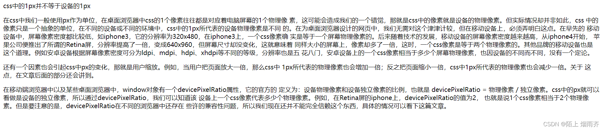

## HTML 系列
### HTML是什么
-  HTML是HyperText Markup Language的简写，表示超文本标记语言
-  HTML并不是一个种编程语言，而是一种标签语言
-  HTML的文档也叫web页面
-  HTML使用标记标签来描述网页

HTML文档由HTML标签构成，每个标签可以包含一些内容或其他标签，这些标签可以帮助浏览器解析文档内容并显示出来。例如，`<html>`标签表示整个HTML文档，`<head>`标签包含文档的元数据（如标题和引用的样式表），而`<body>`标签包含实际的页面内容。

HTML标签可以包含一些属性，这些属性可以提供有关标签的更多信息。例如，``标签可以使用src属性指定图像的URL，`<a>`标签可以使用href属性指定链接的URL。

### HTML结构
HTML代码是由标签组成的
例如：
```
<body>hello world </body>
```
`<body>` `</body>`就是一对完整的标签，一对标签需要一个起始标签和一个结束标签，结束标签开头是一个 / 来表示这对标签的结束，例如：`</body>`。
在开始标签和结束标签之中的内容，就是这个标签需要具体展示的内容 hello world。
大多数标签都是上述这种双标签的结构，只有少数标签是单标签，单标签后面会介绍。
我们还可以给这个标签设置一个唯一的id，id相当于给这个标签设置一个唯一的身份标识。

```
<body id = "my_id"> hello world </body>
```
注意：id是在开始标签中进行设置的。

```
<html >
<head>
    <title>第一个页面</title>
</head>
<body>
    hello world
</body>
</html>
```


-  html标签是整个html文档的最顶层标签/根标签
-  head标签则是写这个html文档的属性的标签
-  title标签则是显示这个文档的标题标签
-  body标签中的内容则是需要显示在页面上的内容

#### head 标签
`<head>` 标签是一个容器标签，用于放置网页的元信息。它的内容不会出现在网页上，而是为网页渲染做准备。

`<head>` 是`<html>` 的第一个子元素。如果网页不包含`<head>` ，浏览器会自动创建一个。

`<head>` 的子元素一般有下面七个。

`<meta>`：设置网页的元数据
`<link>`：链接外部样式表
`<title>`： 设置网页标题
`<style>`：放置内嵌的样式表
`<script>`：引入脚本
`<noscript>`：浏览器不支持脚本时，所要显示的内容
`<base>`：设置网页内部相对 URL 的计算基准。

#### meta 标签
`<meta>` 标签用于设置或说明网页的元数据，必须放在`<head>` 里面。一个`<meta>` 标签就是一项元数据，网页可以有多个`<meta>`

一般来说，网页至少应该具有以下两个`<meta>`标签，而且必须在`<head>`的最前面。
```
<head>
  <meta charset="UTF-8">
  <meta name="viewport" content="width=device-width, initial-scale=1.0">
  <title>Document</title>
</head>
```
charset 属性

`<meta>` 有一个 charset 属性，指定网页的编码方式，该属性非常重要。如果设置得不正确，浏览器可能无法正确解码，就会出现乱码。

name 属性，content 属性

`<meta>` 的 name 属性表示元数据的名字，content 属性表示元数据的值。
```
<head>
  <meta name="description" content="HTML 语言入门">
  <meta name="keywords" content="HTML,教程">
  <meta name="author" content="张三">
</head>
```
上面代码包含了三个元数据：description 是网页内容的描述，keywords 是网页内容的关键字，author 是网页作者。

http-equiv 属性，content 属性

http-equiv 属性用来覆盖 HTTP 回应的头信息字段，content 属性是该字段的内容。
```
<meta http-equiv="Content-Security-Policy" content="default-src 'self'">
```
上面代码可以覆盖 HTTP 回应的 Content-Security-Policy 字段。
#### title 标签
`<title>` 标签用于指定页面的标题，会显示在浏览器窗口的标题栏。
```
<head>
  <title>网页标题</title>
</head>
```
搜索引擎根据这个标签，显示每个网页的标题。它对于网页在搜索引擎的排序，有很大的影响，应该精心安排，反应网页的主题。

`<title>` 标签的内部，不能再放置其他标签，只能放置无格式的纯文本。
#### body 标签
`<body>` 标签是一个容器标签，用于放置网页的主体内容。浏览器显示的页面内容，都是放置在它的内部。它是`<html>` 的第二个子元素，紧跟在`<head>` 后面。
```
<!DOCTYPE html>
<html lang="en">
  <head>
    <meta charset="UTF-8" />
    <title>网页标题</title>
  </head>
  <body>
    <p>hello world</p>
  </body>
</html>
```


### 标签的层次结构
在上述代码中html标签就是所有标签的父标签，head标签是title标签的父标签

head标签和body标签就是兄弟关系。

快速生成代码框架

在vscode中，新建一个html文件后，在文件顶部输入一个 ！之后，按回车，就会生成html的代码框架。

或者新建文件之后，在文件顶部输入 html:5 之后，按回车，也能生成html代码框架。


-  `<!DOCTYPE html>` 称为 DTD (文档类型定义), 描述当前的文件是一个 HTML5 的文件。
-  `<html lang="en">` 其中 lang 属性表示当前页面是一个 "英语页面". 这里暂时不用管. (有些浏览器会根据此处的声明提示是否进行自动翻译)。
-  `<meta charset="UTF-8">` 描述页面的字符编码方式. 没有这一行可能会导致中文乱码。
-  `<meta name="viewport" content="width=device-width, initial-scale=1.0">`name="viewport" 其中 viewport 指的是设备的屏幕上能用来显示我们的网页的那一块区域，content="width=device-width, initial-scale=1.0" 在设置可视区和设备宽度等宽, 并设置初始缩放为不缩放. (这个属性对于移动端开发更重要一些)。
### HTML常见标签
#### 注释标签 `<!-- -->`
注释是所有语言中一个必不可少的东西，在html中同样使用。

html的注释不会显示在页面上，目的就是为了提高代码的可读性。
```
<body>
    hello world    <!-- 我是注释 -->
</body>
```
按照Ctrl+/可以快速生成注释和取消注释。 
#### hr 标签
hr 用来在一篇文章中分隔两个不同的主题，浏览器会将其渲染为一根水平线。该标签是单独使用的，没有闭合标签。
#### hgroup 标签
如果主标题包含多级标题（比如带有副标题），那么可以使用 hgroup 标签，将多级标题放在其中。
```
<hgroup>
  <h1>Heading 1</h1>
  <h1>Subheading 1</h1>
  <h1>Subheading 2</h1>
</hgroup>
```
注意，hgroup 只能包含 h1 ~ h6，不能包含其他标签。
#### 标题标签 h1~h6
共有6个，数字越大，则字体越小。
```
<!DOCTYPE html>
<html lang="en">
<head>
    <meta charset="UTF-8">
    <meta http-equiv="X-UA-Compatible" content="IE=edge">
    <meta name="viewport" content="width=device-width, initial-scale=1.0">
    <title>Document</title>
</head>
<body>
    <h1>标题标签</h1>
    <h2>标题标签</h2>
    <h3>标题标签</h3>
    <h4>标题标签</h4>
    <h5>标题标签</h5>
    <h6>标题标签</h6>
</body>
</html>
```


#### 段落标签 `<p> </p>`

在html中输入换行之后不会真的换行，而是产生一个空格。

在html中输入多个空格之后，在网页上显示的时候不会有多个空格，而是只有一个空格。

在html中，如果需要有一段特别长的文字，但是这段文字在网页上显示的时候并没有产生段落，而是全在一起。这样可读性就会很差。

我们使用段落标签就会解决上述问题：`<p> </p>`

我们可以在需要产生段落的地方添加`<p></p>` 是内容产生段落。

产生段落之后，上面的段落和下面的段落之后有很大的空隙。

#### 换行标签 `<br>`
br是break的缩写，表示换行。

`<br>` 是一个单标签。

使用`<br>` 换行之后，不会想段落标签那样产生很大的空隙。
#### 格式化标签 
-  加粗 strong 标签 和 b 标签
-  倾斜 em 标签 和 i 标签
-  删除线 del 标签 和 s 标签
-  下划线 ins 标签 和 u 标签
```
<body>
    <Strong>加粗</Strong>
    <b>加粗</b>
 
    <em>倾斜</em>
    <i>倾斜</i>
 
    <del>删除线</del>
    <s>删除线</s>
    
    <ins>下划线</ins>
    <u>下划线</u>
 
</body>
```

#### 图片标签 img
img标签必须带有sec的属性，表示这个图片的路径。

相对路径 绝对路径
```
<body>
    相对路径
     <p></p>
    绝对路径
    
</body>
```
alt: 替换文本. 当图片不能正确显示的时候, 会显示一个替换的文字.

title: 提示文本. 鼠标放到图片上, 就会有提示.

width/height: 控制宽度高度. 高度和宽度一般改一个就行, 另外一个会等比例缩放. 否则就会图片
失衡.

width="200px" height="200px" 设置图片的宽度和高度

除了使用绝对路径和相对路径这两种图片的方式之外，还可以使用网络上的图片，前提是网络通畅，还要有网络上这个图片的地址。

例如：我们打开百度的首页，在百度的logo上右击鼠标，我们选择复制图片地址。此时我们就拿到了网络上这个图片的地址。
```
<body>
    相对路径
     <p></p>
    绝对路径
    <p></p>
    网络上的图片
    
</body>
```
#### 超链接标签 a
```
 <a href="https://www.baidu.com">点击进入百度</a>
 ```
href是必须要有的，表示点击后跳转到那个页面。
```
    <a href="https://www.baidu.com" target="_blank">点击进入百度</a>
```
 target表示用新的标签页打开。如果上述的默认，则是在当前标签页打开。

外部链接:表示此链接是引用外部网站的链接。

内部链接:网页内部页面之间的链接，可以直接写相对路径。

我们在当前html1文件的同一个目录下再创建一个html2文件,然后在html2文件里面就可以写其他的网页，当我们点击这个内部之间的链接时，就会跳转到html2.html这个网页上。
```
    <!-- 我是html1 -->
    <a href="html2.html">点我跳转到html2.html</a>
```
空链接： 使用 # 在 href 中占位
```
<a href="#">空链接</a>
```
载链接:

href中写的路径是一个文件，点击就可以进行下载这个文件，（文件可以是zip格式）。

当我们点击下载的时候，浏览器就会自动下载这个文件。
```
    <a href="OIP.zip">点击下载</a>
```
网页元素链接:

可以给图片等任何元素添加链接，当我们点击这个图片时，就会跳转到我们href中所写的地址上去。
```
<a href="https://www.baidu.com" target="_blank">
        
    </a>
```
描点链接:

我们可以给标签给具体的id值，然后在href中填入对应的id的值，就可以进行描点链接跳转。
```
    <a href="#1">跳转到1</a>
    <a href="#2">跳转到2</a>
    <p id="1">
        abc <br>
        def <br>
    </p>
    <p></p>
    <p></p>
    <p id="2">
        hhh <br>
        mooo <br>
    </p>
```
#### 表格标签
-  table 标签: 表示整个表格
-  tr: 表示表格的一行
-  td: 表示一个单元格
-  th: 表示表头单元格. 会居中加粗
-  thead: 表格的头部区域(注意和 th 区分, 范围是比 th 要大的)
-  tbody: 表格得到主体区域.
table 包含 tr , tr 包含 td。
```
 
<body>
    <table  border="1" width ="400px" hight="200px">
        <thead> <!-- 表头标签-->
            <th>姓名</th>   <!-- 表头的单元格  会居中加粗-->
            <th>年龄</th>
            <th>性别</th>
        </thead>
        <tbody>  <!-- 表格的主体区域-->
            <tr> <!-- 表示表格的每一行-->
                <td>张三</td> <!-- 表示表格每个单元格-->
                <td>18</td>
                <td>男</td>
            </tr>  
            <tr> <!-- 表示表格的每一行-->
                <td>李四</td> <!-- 表示表格每个单元格-->
                <td>19</td>
                <td>男</td>
            </tr> 
            <tr> <!-- 表示表格的每一行-->
                <td>王五</td> <!-- 表示表格每个单元格-->
                <td>20</td>
                <td>男</td>
            </tr> 
        </tbody>
    </table>
</body>
```

合并单元格

跨行合并

先群定要合并的单元格，然后需要在合并之前删除多余的单元格

```
<table  border="1" width ="400px" hight="200px">
        <thead> <!-- 表头标签-->
            <th>姓名</th>   <!-- 表头的单元格  会居中加粗-->
            <th>年龄</th>
            <th>性别</th>
        </thead>
        <tbody>  <!-- 表格的主体区域-->
            <tr> <!-- 表示表格的每一行-->
                <td>张三</td> <!-- 表示表格每个单元格-->
                <td>18</td>
                <td>男</td>
            </tr>  
            <tr> <!-- 表示表格的每一行-->
                <td>李四</td> <!-- 表示表格每个单元格-->
                <td rowspan="2">19</td>
                <td>男</td>
            </tr> 
            <tr> <!-- 表示表格的每一行-->
                <td>王五</td> <!-- 表示表格每个单元格-->
                <td>男</td>
            </tr> 
        </tbody>
    </table>
```


跨列合并
```
 <table  border="1" width ="400px" hight="200px">
        <thead> <!-- 表头标签-->
            <th>姓名</th>   <!-- 表头的单元格  会居中加粗-->
            <th>年龄</th>
            <th>性别</th>
        </thead>
        <tbody>  <!-- 表格的主体区域-->
            <tr> <!-- 表示表格的每一行-->
                <td colspan="2">张三</td> <!-- 表示表格每个单元格-->  <!-- 跨列合并-->
                <td>男</td>
            </tr>  
            <tr> <!-- 表示表格的每一行-->
                <td>李四</td> <!-- 表示表格每个单元格-->
                <td rowspan="2">19</td> <!-- 跨行合并-->
                <td>男</td>
            </tr> 
            <tr> <!-- 表示表格的每一行-->
                <td>王五</td> <!-- 表示表格每个单元格-->
                <td>男</td>
            </tr> 
        </tbody>
    </table>
```


#### 列表标签
无序列表  ul li 
```
<h3>无序列表</h3>
    <ul>
        <li>天暗星</li>
        <li>天罡星</li>
        <li>天罪星</li>
    </ul>
```

有序列表  ol  li
```
    <h3>有序列表</h3>
    <ol>
        <li>天暗星</li>
        <li>天罡星</li>
        <li>天罪星</li>
    </ol>
```
自定义列表  dl (总标签) dt (小标题) dd (围绕标题来说明) 上面有个小标题, 下面有几个围绕
```
<h3>自定义列表</h3>
    <dl>
        <dt>不良人</dt>
        <dd>天暗星</dd>
        <dd>天罡星</dd>
        <dd>天罪星</dd>
    </dl>
```
着标题来展开的。

#### 表单标签
表单是让用户输入信息的重要途径.

分成两个部分:

表单域: 包含表单元素的区域. form 标签。

表单控件: 输入框, 提交按钮等. input 标签。

##### form标签

描述了把数据以怎样的方式提交到那个地方。
```
<form action="https://www.baidu.com" method="get">
        <!-- form 中的数据-->
    </form>
```
##### input标签
```
<form action="https://www.baidu.com" method="get">
        <!-- form 中的数据-->
        姓名：<input type="text"><br> <!-- 文本框-->
        密码：<input type="password"><br>  <!-- 密码框-->
        性别：<input type="radio" name="sex" value="男">男&nbsp;&nbsp;&nbsp;&nbsp;<!-- 单选框-->
        <input type="radio" name="sex" value="女">女 &nbsp;&nbsp;&nbsp;&nbsp;
        <input type="radio" name="sex" value="第三性别">第三性别<br>
 
        爱好：<input type="checkbox">听音乐&nbsp;&nbsp; <!-- 复选框-->
        <input type="checkbox">看电视&nbsp;&nbsp;
        <input type="checkbox">打羽毛球 <br>
 
        头像：<input type="file"> <br> <!-- 选择文件标签-->
        日期：<input type="date">   <!-- 日期-->
        颜色：<input type="color">  <!--颜色-->
        提交：<input type="submit">  <!-- 提交按钮-->
    </form>
```


##### select标签

```
大学：<select>  <!-- 下拉菜单标签-->
            <option>北京大学</option>  <!-- 第一个就是默认选项-->
            <option>清华大学</option>
            <option>陇南大学</option>
            <option>兰州大学</option> 
        </select> <br>
```


##### textarea 标签
```
 备注：<textarea cols="50" rows="5"></textarea><br>  
```


#### 无语义标签  div  span
就是两个盒子. 用于网页布局

div 是独占一行的, 是一个大盒子.

span 不独占一行, 是一个小盒子
### 网页的语义结构
HTML 标签的名称都带有语义（semantic），使用时应该尽量符合标签的语义，不要用错误语义的标签。语义良好的网页，天然具有良好的结构，对于开发者易读易写，容易维护，也能帮助计算机更好地处理网页内容。

含义

HTML 标签地一个重要作用，就是声明网页元素地性质，使得用户只看到标签，就能俩姐这个元素地意义，阅读 HTML 源码就能了解网页地大致结构。这被称为 HTML 地语义原则。

下面就是一个典型地语义结构地网页。
```
<body>
  <header>页眉</header>
  <main>
    <article>
      <h1>文章标题</h1>
      <p>文章内容</p>
    </article>
  </main>
  <footer>页尾</footer>
</body>
```
只看上面地代码，就可以知道，页面分为页眉（`<header>`）、主体（`<main>`）、页尾（`<footer>`）三个部分。

编写 HTML 网页，第一步就是写出语义结构地网页骨架。
#### header 标签
header 标签可以用在多个场景，既可以表示整个网页的头部，也可以表示一篇文章或者一个区块的头部。

如果用在网页的头部，就称为“页眉”。网站导航和搜索栏通常会放在 header 标签里面。

```
<header>
  <h1>公司名称</h1>
  <ul>
    <li href="/home">首页</li>
    <li href="/about">关于</li>
    <li href="/contact">联系</li>
  </ul>
  <form target="/search">
    <input name="q" type="search" />
    <input type="submit" />
  </form>
</header>
```
如果 header 用在文章的头部，则可以把文章标题、作者等信息放进去。
```
<article>
  <header>
    <h2>文章标题</h2>
    <p>张三，发表于2010年1月1日</p>
  </header>
</article>
```
由于 header 可以用在多种场景，所以一个页面可能包含多个 header，但是一个具体的场景里面只能包含一个，比如网页的页眉只能有一个。另外，header 里面不能包含另一个 header 或 footer。

#### footer 标签
footer 标签表示网页、文章或章节的尾部。如果用于整张网页的尾部，就称为“页眉”，通常包含版本信息或者其他相关信息

```
<body>
  <footer>
    <p>©	2018	xxx	公司</p>
  </footer>
</body>
```
上面代码中，版权信息放在 footer 里面。

footer 也可以放在文章里面。

footer 不能嵌套，即内部不能放置另一个 footer，也不能放置 header。

#### main 标签
main 标签表示页面的主体内容，一个页面只能有一个 main。
```
<body>
  <header>页眉</header>
  <main>
    <article>文章</article>
  </main>
  <aside>侧边栏</aside>
  <footer>页尾</footer>
</body>
```
上面代码就是最典型的页面结构。

注意，main 是顶层标签，不能放置在 header、footer、article、aside、nav 等标签之中。

另外，功能性区块（比如搜索栏）不适合放入 main，除非当前页面就是搜索页面。
#### article 标签
article 标签表示页面里面一段完整的内容，即使页面的其他部分不存在，也具有独立使用的意义，通常用来表示一篇文章或者一个论坛帖子。它可以有自己的标题（h1 到 h6）。
```
<article>
  <h2>文章标题</h2>
  <p>文章内容</p>
</article>
```
一个网页可以包含一个或多个 article，比如包含多篇文章。
#### aside 标签
aside 标签用来放置与网页或文章主要内容间接相关的部分。网页级别的 aside，可以用来放置侧边栏，但不一定就在页面的侧边；文章级别的 aside，可以用来放置评论或注释。

下面是网页级别的 aside 的例子。
```
<body>
  <main>主体内容</main>
  <aside>侧边栏</aside>
</body>
```

#### section 标签
section 标签表示一个含有主题的独立部分，通常用在文档里面表示一个章节，比如 article 可以包含多个 section。section 总是多个一起使用，一个页面不能只有一个 section。
```
<article>
  <h1>文章标题</h1>
  <section>
    <h2>第一章</h2>
    <p>...</p>
  </section>
  <section>
    <h2>第二章</h2>
    <p>...</p>
  </section>
</article>
```
上面代码中，article 包含了两个 section，代表两章。

section 很适合幻灯片展示的页面，每个 section 代表一个幻灯片。

一般来说，section 都应该有标题，即包含 h2 ~ h6 标签。多个 section 可以放置在同一个 arcticle 里面，一个 section 里面也可能包含多个 arctcle，这取决于 section 和 article 在当前页面的含义。

#### nav 标签
nav 标签用于放置页面或文档的导航信息。
```
<nav>
  <ol>
    <li><a href="item-a">商品 A</a></li>
    <li><a href="item-b">商品 B</a></li>
    <li>商品 C</li>
  </ol>
</nav>
```
一般来说，nav 往往放置在 header 里面，不适合放入 footer。另外，一个页面可以有多个 nav，比如一个用于站点导航，另一个用于文章导航。
### HTML特殊字符对照表
html中某些字符是预留字符, 不能直接使用, 因此需使用代码表示


### 1、什么是 HTML 语义化？
HTML 语意化就是用合乎语意的 HTML 标签开发，标签会清楚定义其内容、让页面兼具良好的语意和结构。以下会提到两个重点，HTML 语意化标签有哪些，另一个是，优点有哪些。
header、 h1~h6、hgroup、nav、main、article、 section、aside、details、time、footer、figure
#### 为什么要使用HTML 语义化标签
提升SEO

比起使用非语意化的标签例如：div、span，语意化标签可以帮助搜寻引擎重视在「标题」、「连结」里的关键字，这样可以让有语意化标签的网页更容易被使用者搜寻到。

便于开发

语意化标签可以提升代码的可读性、帮助开发者之间更容易理解网页架构、减少差异化，举例来说，你可以用div 来做一个按钮，但如果用button 对其他开发者而言会更一目了然知道那是个按钮； 除此之外，透过语意化标签，开发者可以轻易使用其中的原生功能。以 button 来说，就有许多原生功能是 div 没有的。

无障碍网页 (HTML accessibility)

HTML 语意化网站可以方便其他设备解析内容，例如：萤幕阅读器、盲人阅读器、移动设备。 a11y 在前端业界是越来越被看重的领域，用语意化标签也因此是许多公司会看重的。

### html 中的块状元素和行内元素有哪些？
1、块状元素（Block-level Elements）:
   
   块状元素以新行开始，占据一整行的宽度。

   常见的快状元素有： div、p、h1~h6、ul、ol、li、table、form等

2、行内元素（inline Elements）：

   行内元素不会独占一行，它只占据它包含的内容的宽度

   常见的行内元素有：`<span>`、`<a>`、`<strong>`、`<em>`、``、`<input>`、`<button>`等

### HTML5的本地存储机制

1、LocalStorage：LocalStorage是HTML5提供的一种持久化的本地存储方式。它允许网页在浏览器中存储键值对数据，并且该数据在页面关闭后仍然存在。LocalStorage的数据大小限制通常为5MB左右。

2、SessionStorage：SessionStorage也是HTML5提供的一种本地存储方式，与LocalStorage类似，但是SessionStorage的数据在页面关闭后会被清除。SessionStorage适合存储会话期间需要保持的临时数据。

3、IndexedDB：IndexedDB是一种高级的客户端数据库，它允许网页在浏览器中存储结构化数据。IndexedDB提供了更强大的查询和事务支持，适合存储大量数据或需要复杂查询的场景。

4、WebSQL：WebSQL是一种基于SQL的客户端数据库，但是它已经不再被HTML5标准所推荐使用，因为它的规范已经停止更新，并且不被所有浏览器支持。

### HTML中的锚点是什么

HTML中的锚点是指通过`<a>`标签创建的链接，可以在页面内部进行导航，例如跳转到页面的特定位置。

### html中href属性与src的区别？
1、href（Hypertext Reference）是用于指定链接目标的属性。它通常用于在HTML文档中创建超链接，可以链接到其他网页、文件、锚点等。例如，可以使用href属性将文本或图像转换为可点击的链接，点击后会跳转到指定的URL。

2、src（Source）是用于指定资源路径的属性。它通常用于在HTML文档中引入外部资源，如图像、音频、视频等。通过src属性，可以将外部资源嵌入到HTML文档中进行展示或播放。例如，可以使用src属性将图片文件嵌入到``标签中，或者将视频文件嵌入到`<video>`标签中。

href用于创建超链接，指向其他网页
src用于引入外部资源，如图像、音频、视频等。


